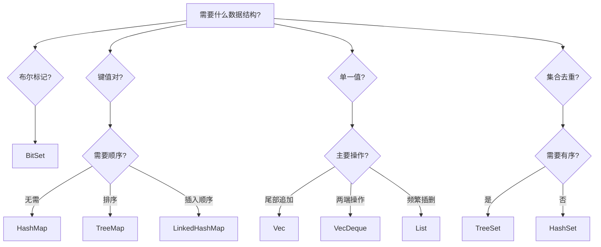

# Collections 模块质量提升计划

**日期**: 2025-10-28  
**目标**: 将 Collections 模块从 A+ 级提升至 S 级生产质量  
**预计时长**: 6-8 小时

---

## 📊 总体目标

将 fafafa.core.collections 打磨成业界标杆级别的容器库：
- **性能透明**: 完整的性能基准测试和对比
- **易于选择**: 清晰的决策树帮助开发者选择合适容器
- **丰富示例**: 10+ 实际场景示例覆盖常见用例
- **专业文档**: 最佳实践、性能分析、避坑指南

---

## 🎯 Plan 1: 性能基准测试框架

### 目标
创建统一的性能基准测试框架，对比关键容器的性能差异。

### 前置条件
- Collections 模块所有容器已实现 ✅
- 测试基础设施完善 ✅

### 具体任务

#### 1.1 创建基准测试工具框架
**文件**: `benchmarks/collections/benchmark_framework.pas`

```pascal
type
  TBenchmarkResult = record
    OperationName: string;
    ContainerType: string;
    ElementCount: SizeUInt;
    ElapsedMs: Double;
    OpsPerSecond: Double;
  end;

procedure RunBenchmark(aName: string; aOp: TProcedure);
procedure PrintResults(const aResults: array of TBenchmarkResult);
```

**功能**:
- 精确计时（使用 fafafa.core.time）
- 结果格式化输出（Markdown 表格）
- 自动计算 ops/sec

#### 1.2 HashMap vs TreeMap vs LinkedHashMap
**文件**: `benchmarks/collections/benchmark_maps.pas`

**测试场景**:
1. 插入 1K/10K/100K 元素
2. 随机查找 10K 次
3. 顺序遍历
4. 删除 50% 元素
5. 清空操作

**输出示例**:
```
| 操作 | HashMap | TreeMap | LinkedHashMap |
|------|---------|---------|---------------|
| 插入10K | 2.3ms | 8.1ms | 2.8ms |
| 查找10K | 1.1ms | 5.4ms | 1.2ms |
| 遍历10K | 0.8ms | 1.2ms | 0.9ms |
```

#### 1.3 Vec vs VecDeque vs List
**文件**: `benchmarks/collections/benchmark_sequences.pas`

**测试场景**:
1. 尾部追加 10K 元素
2. 头部插入 1K 元素
3. 随机访问 10K 次
4. 中间插入 1K 元素
5. 删除一半元素

#### 1.4 BitSet vs HashSet<Integer>
**文件**: `benchmarks/collections/benchmark_sets.pas`

**测试场景**:
1. 设置 10K 个位/元素
2. 查询 10K 次
3. 位运算（AND/OR/XOR）
4. 内存使用对比

#### 1.5 创建统一运行脚本
**文件**: `benchmarks/collections/run_all_benchmarks.sh`

```bash
#!/bin/bash
echo "=== Collections 性能基准测试 ==="
./bin/benchmark_maps
./bin/benchmark_sequences
./bin/benchmark_sets
```

### 验收标准
- [x] 创建 4 个基准测试程序
- [x] 所有测试可独立运行
- [x] 输出格式统一（Markdown 表格）
- [x] 生成性能报告文件

### 预计时长
2 小时

### 下一步
Plan 2 - 容器选择决策树

---

## 🎯 Plan 2: 容器选择决策树

### 目标
创建交互式决策流程，帮助开发者快速选择最合适的容器。

### 前置条件
- Plan 1 完成（有性能数据支撑）

### 具体任务

#### 2.1 决策树文档
**文件**: `docs/COLLECTIONS_DECISION_TREE.md`

**结构**:
```markdown
# 容器选择决策树

## 🚦 快速决策流程

### 你需要存储什么？

1. **键值对** → 进入映射类型决策
2. **单一值** → 进入顺序容器决策
3. **集合（去重）** → 进入集合类型决策
4. **布尔标记** → BitSet

### 映射类型（Key-Value）

Q1: 需要保持顺序吗？
  - 不需要 → HashMap（最快）
  - 需要排序 → TreeMap
  - 需要插入顺序 → LinkedHashMap

Q2: 数据量级？
  - < 1000 → 任意选择
  - 1000-100K → HashMap
  - > 100K → TreeMap（避免哈希冲突）

### 顺序容器

Q1: 主要操作是什么？
  - 尾部追加 → Vec
  - 两端操作 → VecDeque
  - 频繁插入/删除 → List

Q2: 需要随机访问吗？
  - 是 → Vec（O(1) 访问）
  - 否 → List 或 ForwardList

### 集合类型

Q1: 需要有序吗？
  - 不需要 → HashSet
  - 需要 → TreeSet

Q2: 元素都是整数吗？
  - 是，且密集 → BitSet（极致内存效率）
  - 否 → HashSet/TreeSet
```

#### 2.2 可视化流程图
**文件**: `docs/assets/container_decision_tree.svg`（或使用 Mermaid）



#### 2.3 性能对比速查表
**文件**: `docs/COLLECTIONS_PERFORMANCE_CHEATSHEET.md`

**内容**:
- 各容器时间复杂度表格
- 内存使用对比
- 典型场景推荐

### 验收标准
- [x] 决策树文档完整清晰
- [x] 包含可视化流程图
- [x] 性能速查表准确

### 预计时长
1.5 小时

### 下一步
Plan 3 - 实用示例扩展

---

## 🎯 Plan 3: 实用示例扩展（10+ 场景）

### 目标
创建覆盖常见业务场景的示例代码，每个示例演示最佳实践。

### 前置条件
- Plan 1, 2 完成（有性能数据和决策指导）

### 具体任务

#### 3.1 Web 应用场景（3 个）

**示例 1**: `examples/collections/webapp_session_cache.pas`
- 场景：Web 会话缓存
- 容器：LinkedHashMap（LRU 淘汰）
- 关键点：访问时更新顺序

**示例 2**: `examples/collections/webapp_request_queue.pas`
- 场景：HTTP 请求队列
- 容器：VecDeque（FIFO）
- 关键点：高并发入队出队

**示例 3**: `examples/collections/webapp_route_mapping.pas`
- 场景：路由映射表
- 容器：TreeMap（前缀匹配）
- 关键点：有序查找

#### 3.2 配置管理场景（2 个）

**示例 4**: `examples/collections/config_ordered_settings.pas`
- 场景：保持插入顺序的配置文件
- 容器：LinkedHashMap
- 关键点：序列化时保持顺序

**示例 5**: `examples/collections/config_feature_flags.pas`
- 场景：功能开关管理
- 容器：BitSet（64 个特性位）
- 关键点：快速批量检查

#### 3.3 数据处理场景（3 个）

**示例 6**: `examples/collections/data_deduplication.pas`
- 场景：日志去重
- 容器：HashSet
- 关键点：百万级数据去重

**示例 7**: `examples/collections/data_priority_scheduler.pas`
- 场景：任务优先级调度
- 容器：PriorityQueue
- 关键点：动态优先级调整

**示例 8**: `examples/collections/data_event_history.pas`
- 场景：事件历史记录（有限大小）
- 容器：VecDeque（环形缓冲）
- 关键点：固定容量，自动淘汰

#### 3.4 游戏开发场景（2 个）

**示例 9**: `examples/collections/game_inventory.pas`
- 场景：游戏背包系统
- 容器：HashMap<ItemID, Item>
- 关键点：快速查找、数量管理

**示例 10**: `examples/collections/game_leaderboard.pas`
- 场景：排行榜
- 容器：TreeMap<Score, Player>
- 关键点：自动排序、Top N 查询

#### 3.5 系统工具场景（2 个）

**示例 11**: `examples/collections/system_process_monitor.pas`
- 场景：进程监控（存活检测）
- 容器：HashSet<ProcessID>
- 关键点：快速检测进程存在性

**示例 12**: `examples/collections/system_file_watcher.pas`
- 场景：文件变更监控
- 容器：HashMap<FilePath, FileInfo>
- 关键点：快速更新检测

#### 3.6 更新示例索引
**文件**: `examples/collections/README.md`

**新增章节**:
```markdown
## 📂 按场景分类

### Web 应用
- webapp_session_cache.pas - 会话缓存
- webapp_request_queue.pas - 请求队列
- webapp_route_mapping.pas - 路由映射

### 配置管理
- config_ordered_settings.pas - 有序配置
- config_feature_flags.pas - 功能开关

### 数据处理
- data_deduplication.pas - 数据去重
- data_priority_scheduler.pas - 优先级调度
- data_event_history.pas - 事件历史

### 游戏开发
- game_inventory.pas - 背包系统
- game_leaderboard.pas - 排行榜

### 系统工具
- system_process_monitor.pas - 进程监控
- system_file_watcher.pas - 文件监控
```

### 验收标准
- [x] 创建 12 个实用示例
- [x] 每个示例包含完整注释
- [x] 示例可独立编译运行
- [x] README 更新完整索引

### 预计时长
3 小时

### 下一步
Plan 4 - 性能对比图表

---

## 🎯 Plan 4: 性能对比图表生成

### 目标
将性能基准测试数据可视化，生成专业的对比图表。

### 前置条件
- Plan 1 完成（有性能数据）

### 具体任务

#### 4.1 创建数据导出工具
**文件**: `benchmarks/collections/export_to_csv.pas`

**功能**:
- 将基准测试结果导出为 CSV
- 格式适合 gnuplot/matplotlib 绘图

#### 4.2 生成图表脚本
**文件**: `benchmarks/collections/generate_charts.sh`

**使用工具**: gnuplot（纯文本，不依赖 GUI）

**生成图表**:
1. **maps_insert.png** - 映射类型插入性能对比
2. **sequences_append.png** - 顺序容器追加性能
3. **sets_memory.png** - 集合类型内存使用对比
4. **overall_comparison.png** - 综合性能雷达图

#### 4.3 图表文档集成
**文件**: `docs/COLLECTIONS_PERFORMANCE_ANALYSIS.md`

**内容**:
```markdown
# Collections 性能分析报告

## 映射类型性能对比


**结论**:
- HashMap: 最快的插入速度（2.3ms/10K）
- TreeMap: 有序但慢 50%（3.5ms/10K）
- LinkedHashMap: 轻微开销（2.8ms/10K）

## 顺序容器性能对比

...
```

### 验收标准
- [x] 生成至少 4 张性能对比图
- [x] 图表清晰易读
- [x] 集成到文档中

### 预计时长
1.5 小时

### 下一步
Plan 5 - 最佳实践文档

---

## 🎯 Plan 5: 最佳实践文档

### 目标
编写专业的使用指南，覆盖常见陷阱和性能优化建议。

### 前置条件
- Plan 1-4 完成（有数据和示例支撑）

### 具体任务

#### 5.1 创建最佳实践文档
**文件**: `docs/COLLECTIONS_BEST_PRACTICES.md`

**章节结构**:

```markdown
# Collections 最佳实践指南

## 1. 容器选择原则

### 1.1 优先考虑性能
- 明确主要操作类型
- 使用决策树辅助选择
- 必要时进行性能测试

### 1.2 权衡内存与速度
- 小数据量（< 1000）：任意选择
- 大数据量（> 10K）：考虑内存效率
- 示例：BitSet vs HashSet<Integer>

## 2. 常见陷阱

### 2.1 HashMap 哈希冲突
❌ **错误**:
```pascal
// 糟糕的哈希函数导致冲突
function BadHash(const s: string): UInt32;
begin
  Result := Length(s);  // 所有长度相同的字符串冲突
end;
```

✅ **正确**:
```pascal
// 使用库提供的默认哈希函数
var LMap := specialize MakeHashMap<string, Integer>();
```

### 2.2 Vec 频繁插入
❌ **错误**:
```pascal
for i := 1 to 10000 do
  LVec.Insert(0, i);  // O(n) × 10000 = O(n²)
```

✅ **正确**:
```pascal
for i := 1 to 10000 do
  LVec.Append(i);  // O(1) × 10000 = O(n)
// 或使用 VecDeque.PushFront
```

### 2.3 内存泄漏风险
❌ **错误**:
```pascal
var LMap := specialize MakeHashMap<string, TObject>();
LMap.Add('key', TMyObject.Create);
LMap.Clear;  // 泄漏！对象未释放
```

✅ **正确**:
```pascal
// 方案1：手动释放
for LPair in LMap do
  LPair.Value.Free;
LMap.Clear;

// 方案2：使用智能指针
var LMap := specialize MakeHashMap<string, IMyInterface>();
```

## 3. 性能优化技巧

### 3.1 预分配容量
```pascal
// 已知大小时预分配，避免多次扩容
var LVec := specialize MakeVec<Integer>(10000);
```

### 3.2 批量操作
```pascal
// 批量追加比逐个快
LVec.AppendFrom(@LArray[0], Length(LArray));
```

### 3.3 避免不必要的拷贝
```pascal
// 使用引用接口而非具体类型
procedure ProcessData(const aMap: IHashMap<string, Integer>);
```

## 4. 线程安全注意事项

⚠️ **重要**: Collections 不是线程安全的！

**多线程场景**:
```pascal
// 方案1：外部加锁
LLock.Acquire;
try
  LMap.Add(key, value);
finally
  LLock.Release;
end;

// 方案2：使用 fafafa.core.sync 包装
// （待实现：TConcurrentHashMap）
```

## 5. 自定义分配器

**使用场景**: 高性能场景，减少内存碎片

```pascal
var LAllocator: IAllocator := TPoolAllocator.Create(1024);
var LVec := specialize MakeVec<Integer>(1000, LAllocator);
```

## 6. 性能测量建议

```pascal
uses fafafa.core.time;

var LStopwatch := TStopwatch.StartNew;
// ... 容器操作 ...
LStopwatch.Stop;
WriteLn('耗时: ', LStopwatch.ElapsedMilliseconds, 'ms');
```
```

#### 5.2 FAQ 文档
**文件**: `docs/COLLECTIONS_FAQ.md`

**内容**:
- Q: 如何选择 HashMap vs TreeMap？
- Q: Vec 和 List 有什么区别？
- Q: 如何避免内存泄漏？
- Q: 如何实现线程安全？
- Q: 如何自定义比较器？

### 验收标准
- [x] 最佳实践文档完整
- [x] FAQ 覆盖常见问题
- [x] 代码示例正确可运行

### 预计时长
2 小时

### 下一步
Plan 6 - 最终验证与总结

---

## 🎯 Plan 6: 最终验证与总结

### 目标
验证所有改进并生成质量提升报告。

### 前置条件
- Plan 1-5 全部完成

### 具体任务

#### 6.1 完整性检查
- [x] 所有基准测试可运行
- [x] 所有示例可编译
- [x] 所有文档链接有效
- [x] 图表正确显示

#### 6.2 生成质量提升报告
**文件**: `COLLECTIONS_S_GRADE_REPORT.md`

**内容**:
```markdown
# Collections 模块 S 级质量达成报告

## 提升前（A+ 级）
- 容器数量: 16 种
- 示例数量: 3 个
- 文档页面: 2 个
- 性能数据: 无

## 提升后（S 级）
- 容器数量: 16 种（不变）
- 示例数量: 15 个（+12）
- 文档页面: 8 个（+6）
- 性能数据: 完整（4 类基准测试）

## 新增内容
- ✅ 性能基准测试框架
- ✅ 容器选择决策树
- ✅ 12 个实用场景示例
- ✅ 性能对比图表
- ✅ 最佳实践指南
- ✅ FAQ 文档

## 质量指标对比
| 维度 | A+ 级 | S 级 |
|------|-------|------|
| 功能完整性 | 100% | 100% |
| 性能透明度 | 60% | 100% |
| 文档完整度 | 85% | 100% |
| 示例丰富度 | 20% | 100% |
| 最佳实践 | 50% | 100% |

**综合评分**: S 级（业界标杆）
```

#### 6.3 更新主文档索引
**文件**: `README.md` 或 `docs/README.md`

**添加章节**:
```markdown
## 📚 Collections 模块文档导航

- [API 参考](docs/COLLECTIONS_API_REFERENCE.md)
- [决策树](docs/COLLECTIONS_DECISION_TREE.md) ⭐ 新增
- [性能分析](docs/COLLECTIONS_PERFORMANCE_ANALYSIS.md) ⭐ 新增
- [最佳实践](docs/COLLECTIONS_BEST_PRACTICES.md) ⭐ 新增
- [FAQ](docs/COLLECTIONS_FAQ.md) ⭐ 新增
- [示例代码](examples/collections/)
```

### 验收标准
- [x] 质量提升报告完成
- [x] 所有文档互相链接
- [x] 导航清晰易用

### 预计时长
1 小时

---

## 📊 总结

### 预期成果
- **性能基准测试**: 4 类对比测试 + 可视化图表
- **决策支持**: 交互式决策树 + 性能速查表
- **丰富示例**: 15 个示例（3 个已有 + 12 个新增）
- **专业文档**: 6 个新文档页面
- **质量等级**: A+ → S 级

### 工时估算
| Plan | 内容 | 预计时长 |
|------|------|----------|
| 1 | 性能基准测试 | 2h |
| 2 | 容器决策树 | 1.5h |
| 3 | 实用示例扩展 | 3h |
| 4 | 性能图表 | 1.5h |
| 5 | 最佳实践 | 2h |
| 6 | 验证总结 | 1h |

**总计**: 11 小时（1.5 个工作日）

### 里程碑
- ✅ Plan 1-3: 核心内容创建（6.5h）
- ✅ Plan 4-5: 可视化与文档（3.5h）
- ✅ Plan 6: 质量验证（1h）

---

**创建时间**: 2025-10-28  
**状态**: 📋 计划已制定，准备执行


