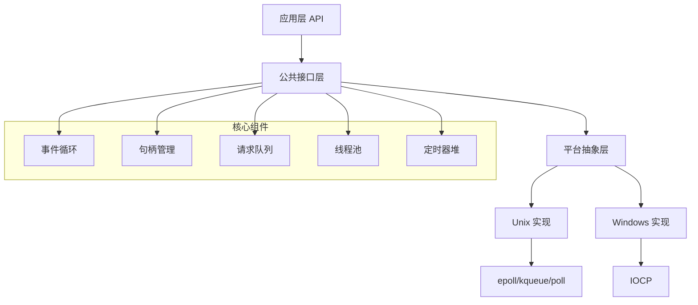

# libuv 架构分析

## 整体架构概览

libuv 采用分层架构设计，从上到下分为以下几层：



## 核心数据结构

### 1. 事件循环 (uv_loop_t)

```c
struct uv_loop_s {
  void* data;                    // 用户数据指针
  unsigned int active_handles;   // 活跃句柄计数
  struct uv__queue handle_queue; // 句柄队列
  union {
    void* unused;
    unsigned int count;
  } active_reqs;                 // 活跃请求计数
  void* internal_fields;         // 内部字段
  unsigned int stop_flag;        // 停止标志
  UV_LOOP_PRIVATE_FIELDS        // 平台特定字段
};
```

**关键特性**:
- 引用计数管理生命周期
- 平台特定的私有字段
- 队列管理所有句柄和请求

### 2. 句柄基类 (uv_handle_t)

所有 I/O 对象的基类，包括：
- TCP/UDP 套接字
- 文件句柄
- 定时器
- 信号处理器
- 异步句柄

### 3. 请求基类 (uv_req_t)

所有异步操作的基类，包括：
- 文件系统操作
- DNS 解析
- 网络连接
- 写入操作

## 模块化设计

### 核心模块

1. **事件循环模块** (`src/unix/loop.c`, `src/win/core.c`)
   - 循环初始化和清理
   - 事件分发机制
   - 平台特定的轮询实现

2. **句柄管理模块**
   - 句柄生命周期管理
   - 引用计数
   - 资源清理

3. **线程池模块** (`src/threadpool.c`)
   - 工作线程管理
   - 任务队列调度
   - 慢速 I/O 处理

4. **定时器模块** (`src/timer.c`)
   - 最小堆实现
   - 高精度定时
   - 定时器回调

### I/O 模块

1. **文件系统** (`src/unix/fs.c`, `src/win/fs.c`)
   - 异步文件操作
   - 目录遍历
   - 文件监控

2. **网络 I/O**
   - TCP: `src/unix/tcp.c`, `src/win/tcp.c`
   - UDP: `src/unix/udp.c`, `src/win/udp.c`
   - 管道: `src/unix/pipe.c`, `src/win/pipe.c`

3. **进程管理** (`src/unix/process.c`, `src/win/process.c`)
   - 子进程创建
   - IPC 通信
   - 信号处理

## 平台抽象策略

### 条件编译

```c
#if defined(_WIN32)
# include "uv/win.h"
#else
# include "uv/unix.h"
#endif
```

### 平台特定实现

**Unix 平台**:
- 使用 epoll (Linux)、kqueue (BSD/macOS)、poll (通用)
- POSIX 线程和信号
- 文件描述符管理

**Windows 平台**:
- 使用 IOCP (I/O Completion Ports)
- Windows 线程和事件
- 句柄管理

### 统一接口

所有平台差异通过统一的 C API 隐藏：

```c
// 统一的事件循环接口
int uv_run(uv_loop_t* loop, uv_run_mode mode);

// 统一的 TCP 接口
int uv_tcp_init(uv_loop_t* loop, uv_tcp_t* handle);
int uv_tcp_bind(uv_tcp_t* handle, const struct sockaddr* addr, unsigned int flags);
```

## 内存管理策略

### 1. 对象池

- 预分配常用对象
- 减少内存分配开销
- 提高缓存局部性

### 2. 引用计数

```c
void uv_ref(uv_handle_t* handle);
void uv_unref(uv_handle_t* handle);
```

- 自动生命周期管理
- 防止内存泄漏
- 确保资源正确释放

### 3. 队列管理

```c
struct uv__queue {
  struct uv__queue* next;
  struct uv__queue* prev;
};
```

- 高效的双向链表
- 常数时间插入/删除
- 内存紧凑布局

## 错误处理机制

### 统一错误码

```c
#define UV_ERRNO_MAP(XX) \
  XX(E2BIG, "argument list too long") \
  XX(EACCES, "permission denied") \
  XX(EADDRINUSE, "address already in use") \
  // ... 更多错误码
```

### 错误传播

- 同步函数返回错误码
- 异步函数通过回调传递错误
- 平台特定错误映射到统一错误码

## 性能优化设计

### 1. 零拷贝

- 使用 `uv_buf_t` 结构避免数据拷贝
- 直接操作用户缓冲区
- 减少内存带宽消耗

### 2. 批量操作

- 批量处理 I/O 事件
- 减少系统调用次数
- 提高吞吐量

### 3. 缓存友好

- 紧凑的数据结构布局
- 顺序访问模式
- 减少缓存未命中

## FreePascal 移植考虑

### 1. 数据结构映射

```pascal
type
  TUVLoop = record
    Data: Pointer;
    ActiveHandles: Cardinal;
    HandleQueue: TUVQueue;
    ActiveReqs: Cardinal;
    InternalFields: Pointer;
    StopFlag: Cardinal;
    // 平台特定字段
  end;
```

### 2. 回调机制

```pascal
type
  TUVCallback = procedure(Handle: PUVHandle; Status: Integer);
  TUVAllocCallback = procedure(Handle: PUVHandle; SuggestedSize: NativeUInt; var Buf: TUVBuf);
```

### 3. 错误处理

```pascal
type
  TUVError = (
    uvOK = 0,
    uvE2BIG = -7,
    uvEACCES = -13,
    // ... 其他错误码
  );
```

### 4. 内存管理

- 使用 Pascal 的自动内存管理
- 实现引用计数接口
- 确保与 C 库的兼容性

## 总结

libuv 的架构设计体现了以下优秀特性：

1. **清晰的分层**: 从 API 到平台实现的清晰分层
2. **模块化**: 功能模块相对独立，便于维护
3. **平台抽象**: 统一接口隐藏平台差异
4. **性能优化**: 多种优化策略确保高性能
5. **错误处理**: 统一的错误处理机制

这些设计原则为 FreePascal 移植提供了良好的参考框架。
