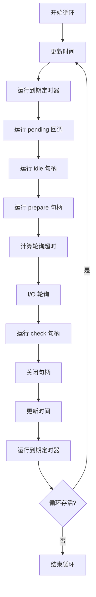

# libuv 事件循环详细分析

## 事件循环概述

libuv 的事件循环是整个异步 I/O 系统的核心，它负责协调所有异步操作的执行。事件循环采用单线程模型，通过非阻塞 I/O 和事件驱动机制实现高并发。

## 事件循环阶段

libuv 事件循环分为以下几个阶段，按顺序执行：



## 核心实现分析

### 1. 主循环函数 (uv_run)

```c
int uv_run(uv_loop_t* loop, uv_run_mode mode) {
  int timeout;
  int r;
  int can_sleep;

  r = uv__loop_alive(loop);
  if (!r)
    uv__update_time(loop);

  // 兼容性处理：UV_RUN_DEFAULT 模式下预先运行定时器
  if (mode == UV_RUN_DEFAULT && r != 0 && loop->stop_flag == 0) {
    uv__update_time(loop);
    uv__run_timers(loop);
  }

  while (r != 0 && loop->stop_flag == 0) {
    can_sleep = uv__queue_empty(&loop->pending_queue) &&
                uv__queue_empty(&loop->idle_handles);

    uv__run_pending(loop);    // 运行 pending 回调
    uv__run_idle(loop);       // 运行 idle 句柄
    uv__run_prepare(loop);    // 运行 prepare 句柄

    timeout = 0;
    if ((mode == UV_RUN_ONCE && can_sleep) || mode == UV_RUN_DEFAULT)
      timeout = uv__backend_timeout(loop);

    uv__io_poll(loop, timeout);  // I/O 轮询

    // 处理立即回调，限制次数防止饥饿
    for (r = 0; r < 8 && !uv__queue_empty(&loop->pending_queue); r++)
      uv__run_pending(loop);

    uv__run_check(loop);         // 运行 check 句柄
    uv__run_closing_handles(loop); // 关闭句柄

    uv__update_time(loop);       // 更新时间
    uv__run_timers(loop);        // 运行定时器

    r = uv__loop_alive(loop);
    if (mode == UV_RUN_ONCE || mode == UV_RUN_NOWAIT)
      break;
  }

  if (loop->stop_flag != 0)
    loop->stop_flag = 0;

  return r;
}
```

### 2. 运行模式

```c
typedef enum {
  UV_RUN_DEFAULT = 0,  // 持续运行直到没有活跃句柄
  UV_RUN_ONCE,         // 运行一次，处理所有事件
  UV_RUN_NOWAIT        // 非阻塞运行，立即返回
} uv_run_mode;
```

### 3. 循环存活检查

```c
static int uv__loop_alive(const uv_loop_t* loop) {
  return uv__has_active_handles(loop) ||
         uv__has_active_reqs(loop) ||
         !uv__queue_empty(&loop->closing_handles);
}
```

## 各阶段详细分析

### 1. 定时器阶段 (Timers)

**实现**: 使用最小堆数据结构

```c
void uv__run_timers(uv_loop_t* loop) {
  struct heap_node* heap_node;
  uv_timer_t* handle;

  for (;;) {
    heap_node = heap_min(timer_heap(loop));
    if (heap_node == NULL)
      break;

    handle = container_of(heap_node, uv_timer_t, heap_node);
    if (handle->timeout > loop->time)
      break;

    uv_timer_stop(handle);
    uv_timer_again(handle);
    handle->timer_cb(handle);
  }
}
```

**特点**:
- O(log n) 插入和删除
- 高精度时间管理
- 支持重复定时器

### 2. Pending 回调阶段

处理上一轮循环中延迟的 I/O 回调：

```c
static void uv__run_pending(uv_loop_t* loop) {
  struct uv__queue* q;
  struct uv__queue pq;
  uv__io_t* w;

  if (uv__queue_empty(&loop->pending_queue))
    return;

  uv__queue_move(&loop->pending_queue, &pq);
  while (!uv__queue_empty(&pq)) {
    q = uv__queue_head(&pq);
    uv__queue_remove(q);
    uv__queue_init(q);
    w = uv__queue_data(q, uv__io_t, pending_queue);
    w->cb(loop, w, POLLOUT);
  }
}
```

### 3. Idle 和 Prepare 阶段

**Idle 句柄**: 每次循环都会运行（如果有活跃的 idle 句柄）
**Prepare 句柄**: 在 I/O 轮询之前运行

```c
#define UV_LOOP_WATCHER_DEFINE(name, type)                                    \
  int uv_##name##_init(uv_loop_t* loop, uv_##name##_t* handle) {              \
    uv__handle_init(loop, (uv_handle_t*)handle, UV_##type);                   \
    handle->name##_cb = NULL;                                                 \
    return 0;                                                                 \
  }                                                                           \
                                                                              \
  int uv_##name##_start(uv_##name##_t* handle, uv_##name##_cb cb) {           \
    if (uv__is_active(handle))                                                \
      return 0;                                                               \
    if (cb == NULL)                                                           \
      return UV_EINVAL;                                                       \
    uv__queue_insert_head(&handle->loop->name##_handles, &handle->queue);     \
    handle->name##_cb = cb;                                                   \
    uv__handle_start(handle);                                                 \
    return 0;                                                                 \
  }
```

### 4. I/O 轮询阶段

这是最重要的阶段，处理所有 I/O 事件：

**Unix 实现** (epoll/kqueue):
```c
void uv__io_poll(uv_loop_t* loop, int timeout) {
  // 平台特定的轮询实现
  // Linux: epoll_wait
  // macOS/BSD: kevent
  // 其他: poll
}
```

**Windows 实现** (IOCP):
```c
void uv__poll(uv_loop_t* loop, int timeout) {
  GetQueuedCompletionStatus(loop->iocp, ...);
  // 处理完成的 I/O 操作
}
```

### 5. Check 阶段

在 I/O 轮询之后立即运行：

```c
static void uv__run_check(uv_loop_t* loop) {
  uv_check_t* handle;
  struct uv__queue* q;

  uv__queue_foreach(q, &loop->check_handles) {
    handle = uv__queue_data(q, uv_check_t, queue);
    handle->check_cb(handle);
  }
}
```

### 6. 关闭句柄阶段

处理需要关闭的句柄：

```c
static void uv__run_closing_handles(uv_loop_t* loop) {
  uv_handle_t* p;
  uv_handle_t* q;

  p = loop->closing_handles;
  loop->closing_handles = NULL;

  while (p) {
    q = p->next_closing;
    uv__finish_close(p);
    p = q;
  }
}
```

## 性能优化策略

### 1. 时间缓存

```c
UV_UNUSED(static void uv__update_time(uv_loop_t* loop)) {
  /* Use a fast time source if available.  We only need millisecond precision.
   */
  loop->time = uv__hrtime(UV_CLOCK_FAST) / 1000000;
}
```

- 缓存当前时间，避免频繁系统调用
- 只在循环开始和结束时更新

### 2. 批量处理

- 限制 pending 回调处理次数（最多 8 次）
- 防止某个阶段占用过多时间
- 确保事件循环的公平性

### 3. 超时计算优化

```c
int uv__backend_timeout(const uv_loop_t* loop) {
  if (loop->stop_flag != 0)
    return 0;

  if (!uv__has_active_handles(loop) && !uv__has_active_reqs(loop))
    return 0;

  if (!uv__queue_empty(&loop->idle_handles))
    return 0;

  if (!uv__queue_empty(&loop->pending_queue))
    return 0;

  if (loop->closing_handles)
    return 0;

  return uv__next_timeout(loop);
}
```

## 平台差异

### Unix 平台

- 使用 epoll (Linux)、kqueue (BSD/macOS)、poll (通用)
- 文件描述符事件驱动
- 信号处理集成

### Windows 平台

- 使用 IOCP (I/O Completion Ports)
- 异步 I/O 完成通知
- 不同的句柄管理机制

## FreePascal 移植考虑

### 1. 事件循环结构

```pascal
type
  TUVRunMode = (
    uvRunDefault = 0,
    uvRunOnce = 1,
    uvRunNoWait = 2
  );

  TUVLoop = class
  private
    FData: Pointer;
    FActiveHandles: Cardinal;
    FStopFlag: Boolean;
    FTime: UInt64;
    // 各种队列和句柄列表
  public
    function Run(Mode: TUVRunMode): Integer;
    procedure Stop;
    function IsAlive: Boolean;
  end;
```

### 2. 回调接口

```pascal
type
  TUVTimerCallback = procedure(Timer: TUVTimer) of object;
  TUVIdleCallback = procedure(Idle: TUVIdle) of object;
  TUVPrepareCallback = procedure(Prepare: TUVPrepare) of object;
  TUVCheckCallback = procedure(Check: TUVCheck) of object;
```

### 3. 异常处理

```pascal
type
  EUVError = class(Exception)
  private
    FErrorCode: Integer;
  public
    constructor Create(ErrorCode: Integer);
    property ErrorCode: Integer read FErrorCode;
  end;
```

## 总结

libuv 的事件循环设计体现了以下优秀特性：

1. **清晰的阶段划分**: 每个阶段职责明确
2. **高效的调度**: 通过优先级和批量处理优化性能
3. **平台抽象**: 统一接口隐藏平台差异
4. **可控的执行**: 支持不同的运行模式
5. **防饥饿机制**: 限制单个阶段的执行时间

这些设计原则为 FreePascal 实现提供了重要参考。
