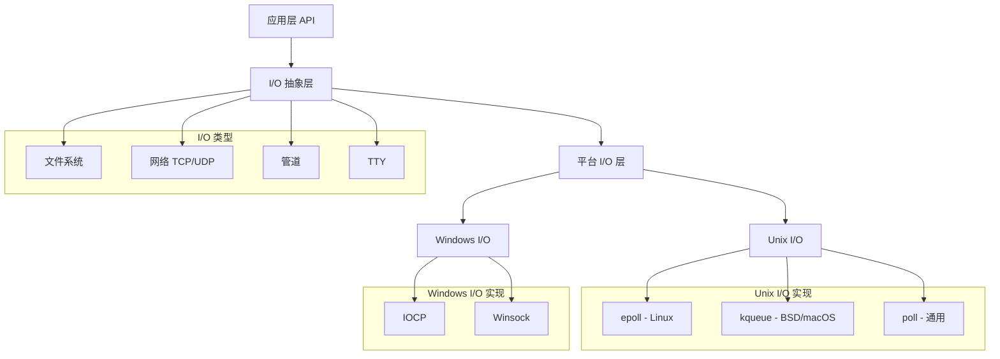

# libuv I/O 实现机制分析

## I/O 架构概览

libuv 的 I/O 系统采用异步非阻塞模型，通过事件驱动机制实现高性能的并发处理。整个 I/O 系统分为以下几个层次：



## 核心 I/O 数据结构

### 1. I/O 观察者 (uv__io_t)

```c
struct uv__io_s {
  uv__io_cb cb;                    // I/O 回调函数
  struct uv__queue pending_queue;  // 待处理队列
  struct uv__queue watcher_queue;  // 观察者队列
  unsigned int pevents;            // 上次轮询的事件
  unsigned int events;             // 当前关注的事件
  int fd;                          // 文件描述符
  UV_IO_PRIVATE_FIELDS            // 平台特定字段
};
```

### 2. 缓冲区结构 (uv_buf_t)

```c
typedef struct uv_buf_t {
  char* base;    // 缓冲区基地址
  size_t len;    // 缓冲区长度
} uv_buf_t;
```

### 3. 流基类 (uv_stream_t)

所有流式 I/O 的基类，包括 TCP、UDP、管道等：

```c
struct uv_stream_s {
  UV_HANDLE_FIELDS
  size_t write_queue_size;         // 写队列大小
  uv_alloc_cb alloc_cb;           // 内存分配回调
  uv_read_cb read_cb;             // 读取回调
  UV_STREAM_PRIVATE_FIELDS        // 平台特定字段
};
```

## 文件系统 I/O

### 异步文件操作

libuv 将所有文件系统操作都放在线程池中执行，避免阻塞事件循环：

```c
int uv_fs_open(uv_loop_t* loop,
               uv_fs_t* req,
               const char* path,
               int flags,
               int mode,
               uv_fs_cb cb) {
  INIT(OPEN);
  PATH;
  req->flags = flags;
  req->mode = mode;
  POST;
}
```

**实现机制**:
1. 请求提交到线程池
2. 工作线程执行实际的文件操作
3. 完成后通过事件循环回调通知

### 文件操作类型

```c
typedef enum {
  UV_FS_UNKNOWN = -1,
  UV_FS_CUSTOM,
  UV_FS_OPEN,
  UV_FS_CLOSE,
  UV_FS_READ,
  UV_FS_WRITE,
  UV_FS_SENDFILE,
  UV_FS_STAT,
  UV_FS_LSTAT,
  UV_FS_FSTAT,
  UV_FS_FTRUNCATE,
  UV_FS_UTIME,
  UV_FS_FUTIME,
  UV_FS_ACCESS,
  UV_FS_CHMOD,
  UV_FS_FCHMOD,
  UV_FS_FSYNC,
  UV_FS_FDATASYNC,
  UV_FS_UNLINK,
  UV_FS_RMDIR,
  UV_FS_MKDIR,
  UV_FS_MKDTEMP,
  UV_FS_RENAME,
  UV_FS_SCANDIR,
  UV_FS_LINK,
  UV_FS_SYMLINK,
  UV_FS_READLINK,
  UV_FS_CHOWN,
  UV_FS_FCHOWN,
  UV_FS_REALPATH,
  UV_FS_COPYFILE,
  UV_FS_LCHOWN,
  UV_FS_OPENDIR,
  UV_FS_READDIR,
  UV_FS_CLOSEDIR,
  UV_FS_STATFS,
  UV_FS_MKSTEMP,
  UV_FS_LUTIME
} uv_fs_type;
```

### 零拷贝优化

**sendfile 系统调用**:
```c
static ssize_t uv__fs_sendfile(uv_fs_t* req) {
#if defined(__linux__) || defined(__sun)
  return sendfile(req->flags, req->file, &req->off, req->bufsml[0].len);
#elif defined(__APPLE__) || defined(__FreeBSD__)
  off_t len;
  int r;
  len = req->bufsml[0].len;
  r = sendfile(req->file, req->flags, req->off, &len, NULL, 0);
  req->off = len;
  return r;
#else
  return uv__fs_copy_file_range(req);
#endif
}
```

## 网络 I/O

### TCP 实现

**TCP 连接建立**:
```c
int uv_tcp_connect(uv_connect_t* req,
                   uv_tcp_t* handle,
                   const struct sockaddr* addr,
                   uv_connect_cb cb) {
  int err;
  int r;

  assert(handle->type == UV_TCP);
  
  if (handle->connect_req != NULL)
    return UV_EALREADY;  /* FIXME(bnoordhuis) UV_EINVAL or maybe UV_EBUSY. */

  err = maybe_new_socket(handle,
                         addr->sa_family,
                         UV_HANDLE_READABLE | UV_HANDLE_WRITABLE);
  if (err)
    return err;

  handle->delayed_error = 0;

  do {
    errno = 0;
    r = connect(uv__stream_fd(handle), addr, uv__sockaddr_len(addr));
  } while (r == -1 && errno == EINTR);

  /* We not only check the return value, but also check the errno != 0.
   * Because on solaris, the connect() might return -1 and the errno
   * is 0 (undocumented behavior), we should try again.
   */
  if (r == -1 && errno != 0) {
    if (errno == EINPROGRESS)
      ; /* not an error */
    else if (errno == ECONNREFUSED
#if defined(__OpenBSD__)
      || errno == EINVAL
#endif
      )
      /* If we get ECONNREFUSED (Solaris) or EINVAL (OpenBSD) wait until the
       * next tick to report the error. Solaris wants to report immediately--
       * other unixes want to wait.
       */
      handle->delayed_error = UV__ERR(ECONNREFUSED);
    else
      return UV__ERR(errno);
  }

  uv__req_init(handle->loop, req, UV_CONNECT);
  req->cb = cb;
  req->handle = (uv_stream_t*) handle;
  uv__queue_init(&req->queue);
  handle->connect_req = req;

  uv__io_start(handle->loop, &handle->io_watcher, POLLOUT);

  if (handle->delayed_error)
    uv__io_feed(handle->loop, &handle->io_watcher);

  return 0;
}
```

**TCP 数据读取**:
```c
int uv_read_start(uv_stream_t* stream,
                  uv_alloc_cb alloc_cb,
                  uv_read_cb read_cb) {
  if (stream == NULL || alloc_cb == NULL || read_cb == NULL)
    return UV_EINVAL;

  if (stream->flags & UV_HANDLE_CLOSING)
    return UV_EINVAL;

  if (!(stream->flags & UV_HANDLE_READABLE))
    return UV_ENOTCONN;

  /* The UV_HANDLE_READING flag is irrelevant of the state of the tcp - it just
   * expresses the desired state of the user.
   */
  stream->flags |= UV_HANDLE_READING;

  /* TODO: try to do the read inline? */
  /* TODO: keep track of tcp state. If we've gotten a EOF then we should
   * not start the IO watcher.
   */
  assert(stream->io_watcher.fd >= 0);
  assert(alloc_cb);

  stream->read_cb = read_cb;
  stream->alloc_cb = alloc_cb;

  uv__io_start(stream->loop, &stream->io_watcher, POLLIN);
  uv__handle_start(stream);

  return 0;
}
```

### UDP 实现

**UDP 数据发送**:
```c
int uv_udp_send(uv_udp_send_t* req,
                uv_udp_t* handle,
                const uv_buf_t bufs[],
                unsigned int nbufs,
                const struct sockaddr* addr,
                uv_udp_send_cb send_cb) {
  int err;
  int empty_queue;

  assert(nbufs > 0);

  if (addr) {
    err = maybe_bind_socket(handle);
    if (err)
      return err;
  }

  if (uv__udp_maybe_deferred_bind(handle, addr->sa_family, 0))
    return UV_EBADF;

  empty_queue = (handle->send_queue_count == 0);

  uv__req_init(handle->loop, req, UV_UDP_SEND);
  assert(addr);
  req->addr = *addr;
  req->send_cb = send_cb;
  req->handle = handle;
  req->nbufs = nbufs;

  req->bufs = req->bufsml;
  if (nbufs > ARRAY_SIZE(req->bufsml))
    req->bufs = uv__malloc(nbufs * sizeof(bufs[0]));

  if (req->bufs == NULL) {
    uv__req_unregister(handle->loop, req);
    return UV_ENOMEM;
  }

  memcpy(req->bufs, bufs, nbufs * sizeof(bufs[0]));
  uv__queue_insert_tail(&handle->send_queue, &req->queue);
  handle->send_queue_count++;

  if (empty_queue && !(handle->flags & UV_HANDLE_UDP_PROCESSING)) {
    uv__udp_sendmsg(handle);
  } else {
    uv__io_start(handle->loop, &handle->io_watcher, POLLOUT);
  }

  return 0;
}
```

## I/O 多路复用实现

### Linux - epoll

```c
void uv__io_poll(uv_loop_t* loop, int timeout) {
  struct epoll_event events[1024];
  struct epoll_event* pe;
  struct epoll_event e;
  int real_timeout;
  struct uv__queue* q;
  uv__io_t* w;
  sigset_t sigset;
  uint64_t sigmask;
  uint64_t base;
  int have_signals;
  int nevents;
  int count;
  int nfds;
  int fd;
  int op;
  int i;
  int user_timeout;
  int reset_timeout;

  if (loop->nfds == 0) {
    assert(uv__queue_empty(&loop->watcher_queue));
    return;
  }

  memset(&e, 0, sizeof(e));

  while (!uv__queue_empty(&loop->watcher_queue)) {
    q = uv__queue_head(&loop->watcher_queue);
    uv__queue_remove(q);
    uv__queue_init(q);

    w = uv__queue_data(q, uv__io_t, watcher_queue);
    assert(w->pevents != 0);
    assert(w->fd >= 0);
    assert(w->fd < (int) loop->nwatchers);

    e.events = w->pevents;
    e.data.fd = w->fd;

    if (w->events == 0)
      op = EPOLL_CTL_DEL;
    else if (w->pevents == 0)
      op = EPOLL_CTL_ADD;
    else
      op = EPOLL_CTL_MOD;

    /* XXX(bnoordhuis) Given that we're doing a linear scan over the
     * watcher list, it might be worthwhile to batch the epoll_ctl()
     * calls. Turn the control list into a binary tree if we can't.
     *
     * Ephemeral observation: doing EPOLL_CTL_MOD in a loop over a hundred
     * thousand items is about a 2% performance hit compared to control batch.
     * The delay is neatly observable: curl -T preload-file localhost:8000
     * from a terminal. Data gets transferred in bursts of 8k at a time.
     */
    if (epoll_ctl(loop->backend_fd, op, w->fd, &e))
      if (errno != EEXIST)
        abort();

    w->pevents = w->events;
  }

  sigmask = 0;
  if (loop->flags & UV_LOOP_BLOCK_SIGPROF) {
    sigemptyset(&sigset);
    sigaddset(&sigset, SIGPROF);
    sigmask |= 1 << (SIGPROF - 1);
  }

  assert(timeout >= -1);
  base = loop->time;
  count = 48; /* Benchmarks suggest this gives the best throughput. */
  real_timeout = timeout;

  if (uv__get_internal_fields(loop)->flags & UV_METRICS_IDLE_TIME) {
    reset_timeout = 1;
    user_timeout = timeout;
    timeout = 0;
  } else {
    reset_timeout = 0;
    user_timeout = 0;
  }

  /* You could argue there is a dependency between these two but
   * ultimately the timeout checks are guarded by the boolean and
   * the boolean is only set when there is a valid timeout.  */
  SAVE_ERRNO(have_signals = uv__signals_pending(loop));
  if (have_signals != 0)
    timeout = 0;

  if (sigmask != 0 && timeout != 0) {
    uv__metrics_set_provider_entry_time(loop);
    nfds = epoll_pwait(loop->backend_fd, events, ARRAY_SIZE(events), timeout, &sigset);
    uv__metrics_update_idle_time(loop);
  } else {
    uv__metrics_set_provider_entry_time(loop);
    nfds = epoll_wait(loop->backend_fd, events, ARRAY_SIZE(events), timeout);
    uv__metrics_update_idle_time(loop);
  }

  /* Update loop->time unconditionally. It's tempting to skip the update when
   * timeout == 0 (i.e. non-blocking poll) but there is no guarantee that the
   * operating system didn't reschedule our process while in the syscall.
   */
  SAVE_ERRNO(uv__update_time(loop));

  if (nfds == 0) {
    assert(timeout != -1);

    if (reset_timeout != 0) {
      timeout = user_timeout;
      reset_timeout = 0;
    }

    if (timeout == -1)
      return;

    if (timeout == 0)
      return;

    /* We may have been inside the system call for longer than |timeout|
     * milliseconds so we need to update the timestamp to avoid drift.
     */
    goto update_timeout;
  }

  if (nfds == -1) {
    if (errno == ENOSYS) {
      /* epoll_wait() or epoll_pwait() failed, try the next batch. */
      assert(loop->watchers != NULL);
      assert(loop->nwatchers > 0);
      loop->watchers[loop->nwatchers] = (void*) events;
      loop->watchers[loop->nwatchers + 1] = (void*) (uintptr_t) nfds;
      return;
    }

    if (errno == EINTR)
      return;

    abort();
  }

  have_signals = 0;
  nevents = 0;

  {
    /* Squelch a -Waddress-of-packed-member warning with gcc >= 9. */
    union {
      struct epoll_event* events;
      uv__io_t* watchers;
    } x;

    x.events = events;
    assert(loop->watchers != NULL);
    loop->watchers[loop->nwatchers] = x.watchers;
    loop->watchers[loop->nwatchers + 1] = (void*) (uintptr_t) nfds;
  }

  for (i = 0; i < nfds; i++) {
    pe = events + i;
    fd = pe->data.fd;

    /* Skip invalidated events, see uv__platform_invalidate_fd */
    if (fd == -1)
      continue;

    assert(fd >= 0);
    assert((unsigned) fd < loop->nwatchers);

    w = loop->watchers[fd];

    if (w == NULL) {
      /* File descriptor that we've stopped watching, disarm it.
       *
       * Ignore all errors because we may be racing with another thread
       * when the file descriptor is closed.
       */
      epoll_ctl(loop->backend_fd, EPOLL_CTL_DEL, fd, pe);
      continue;
    }

    /* Give users only events they're interested in. Prevents spurious
     * callbacks when previous callback invocation in this loop has stopped
     * the current watcher. Also, filters out events that users has not
     * requested us to watch.
     */
    pe->events &= w->pevents | POLLERR | POLLHUP;

    /* Work around an epoll quirk where it sometimes reports just the
     * EPOLLERR or EPOLLHUP event.  In order to force the event loop to
     * move forward, we merge in the read/write events that the watcher
     * is interested in; uv__read() and uv__write() will then deal with
     * the error or hangup in the usual fashion.
     *
     * Note to self: happens when epoll reports EPOLLIN|EPOLLHUP, the user
     * reads the available data, calls uv_read_stop(), then sometime later
     * calls uv_read_start() again.  By then, libuv has forgotten about the
     * hangup and the kernel won't report EPOLLIN again because there's
     * nothing left to read.  If anything, libuv is to blame here.  The
     * current hack is just a quick bandaid; to properly fix it, libuv
     * needs to remember the error/hangup event.  We should get that for
     * free when we switch over to edge-triggered I/O.
     */
    if (pe->events == POLLERR || pe->events == POLLHUP)
      pe->events |=
        w->pevents & (POLLIN | POLLOUT | UV__POLLRDHUP | UV__POLLPRI);

    if (pe->events != 0) {
      /* Run signal watchers last.  This also affects child process watchers
       * because those are implemented in terms of signal watchers.
       */
      if (w == &loop->signal_io_watcher) {
        have_signals = 1;
      } else {
        uv__metrics_update_idle_time(loop);
        w->cb(loop, w, pe->events);
      }

      nevents++;
    }
  }

  if (reset_timeout != 0) {
    timeout = user_timeout;
    reset_timeout = 0;
  }

  if (have_signals != 0) {
    uv__metrics_update_idle_time(loop);
    loop->signal_io_watcher.cb(loop, &loop->signal_io_watcher, POLLIN);
  }

  loop->watchers[loop->nwatchers] = NULL;
  loop->watchers[loop->nwatchers + 1] = NULL;

  if (have_signals != 0)
    return;  /* Event loop should cycle now so don't poll again. */

  if (nevents != 0) {
    if (nfds == ARRAY_SIZE(events) && --count != 0) {
      /* Poll for more events but don't block this time. */
      timeout = 0;
      goto repeat;
    }
    return;
  }

  if (timeout == 0)
    return;

  if (timeout == -1)
    return;

update_timeout:
  assert(timeout > 0);

  real_timeout -= (loop->time - base);
  if (real_timeout <= 0)
    return;

  timeout = real_timeout;

repeat:
  if (timeout != 0)
    goto repeat;
}
```

### macOS/BSD - kqueue

kqueue 是 BSD 系统（包括 macOS）的高性能事件通知机制：

```c
void uv__io_poll(uv_loop_t* loop, int timeout) {
  struct kevent events[1024];
  struct kevent* ev;
  struct timespec spec;
  // ... 变量声明

  // 处理观察者队列，设置 kevent 结构
  while (!uv__queue_empty(&loop->watcher_queue)) {
    w = uv__queue_data(q, uv__io_t, watcher_queue);

    // 添加读事件监听
    if ((w->events & POLLIN) && !(w->pevents & POLLIN)) {
      filter = EVFILT_READ;
      if (w->cb == uv__fs_event_read) {
        filter = EVFILT_VNODE;  // 文件系统事件
        fflags = NOTE_ATTRIB | NOTE_WRITE | NOTE_RENAME;
      }
      EV_SET(events + nevents, w->fd, filter, EV_ADD, fflags, 0, 0);
      nevents++;
    }

    // 添加写事件监听
    if ((w->events & POLLOUT) && !(w->pevents & POLLOUT)) {
      EV_SET(events + nevents, w->fd, EVFILT_WRITE, EV_ADD, 0, 0, 0);
      nevents++;
    }
  }

  // 执行 kevent 系统调用
  nfds = kevent(loop->backend_fd, NULL, 0, events,
                ARRAY_SIZE(events), timeout == -1 ? NULL : &spec);

  // 处理返回的事件
  for (i = 0; i < nfds; i++) {
    ev = events + i;
    fd = ev->ident;

    // 转换事件类型
    if (ev->filter == EVFILT_READ) revents |= POLLIN;
    if (ev->filter == EVFILT_WRITE) revents |= POLLOUT;
    if (ev->flags & EV_ERROR) revents |= POLLERR;
    if (ev->flags & EV_EOF) revents |= POLLHUP;

    // 调用回调函数
    w->cb(loop, w, revents);
  }
}
```

**kqueue 特点**:
- 支持多种事件类型（文件、网络、进程、信号等）
- 边缘触发模式
- 高效的事件过滤和通知
```

## 内存管理策略

### 1. 缓冲区管理

```c
typedef void (*uv_alloc_cb)(uv_handle_t* handle,
                           size_t suggested_size,
                           uv_buf_t* buf);
```

- 用户控制内存分配
- 避免不必要的内存拷贝
- 支持预分配缓冲区池

### 2. 写入队列管理

```c
struct uv_write_s {
  UV_REQ_FIELDS
  uv_write_cb cb;
  uv_stream_t* send_handle;
  uv_stream_t* handle;
  UV_WRITE_PRIVATE_FIELDS
};
```

- 批量写入优化
- 写入队列大小限制
- 背压控制机制

## FreePascal 移植考虑

### 1. I/O 接口设计

```pascal
type
  TUVIOCallback = procedure(Loop: TUVLoop; Watcher: TUVIOWatcher; Events: Cardinal);
  TUVAllocCallback = procedure(Handle: TUVHandle; SuggestedSize: NativeUInt; var Buf: TUVBuf);
  TUVReadCallback = procedure(Stream: TUVStream; NRead: NativeInt; const Buf: TUVBuf);
  TUVWriteCallback = procedure(Req: TUVWriteReq; Status: Integer);

  TUVIOWatcher = class
  private
    FCallback: TUVIOCallback;
    FEvents: Cardinal;
    FPrevEvents: Cardinal;
    FFD: THandle;
  public
    procedure Start(Events: Cardinal);
    procedure Stop;
    property Events: Cardinal read FEvents;
    property FileDescriptor: THandle read FFD;
  end;
```

### 2. 流抽象

```pascal
type
  TUVStream = class(TUVHandle)
  private
    FWriteQueueSize: NativeUInt;
    FAllocCallback: TUVAllocCallback;
    FReadCallback: TUVReadCallback;
  public
    function ReadStart(AllocCB: TUVAllocCallback; ReadCB: TUVReadCallback): Integer;
    function ReadStop: Integer;
    function Write(const Bufs: array of TUVBuf; WriteCB: TUVWriteCallback): Integer;
    property WriteQueueSize: NativeUInt read FWriteQueueSize;
  end;
```

### 3. 平台抽象

```pascal
type
  TUVPlatformIO = class abstract
  public
    class function Poll(Loop: TUVLoop; Timeout: Integer): Integer; virtual; abstract;
    class function AddWatcher(Loop: TUVLoop; Watcher: TUVIOWatcher): Integer; virtual; abstract;
    class function RemoveWatcher(Loop: TUVLoop; Watcher: TUVIOWatcher): Integer; virtual; abstract;
  end;

  TUVEpollIO = class(TUVPlatformIO)
  public
    class function Poll(Loop: TUVLoop; Timeout: Integer): Integer; override;
    class function AddWatcher(Loop: TUVLoop; Watcher: TUVIOWatcher): Integer; override;
    class function RemoveWatcher(Loop: TUVLoop; Watcher: TUVIOWatcher): Integer; override;
  end;
```

## 总结

libuv 的 I/O 实现体现了以下优秀特性：

1. **统一抽象**: 为不同类型的 I/O 提供统一接口
2. **平台优化**: 充分利用各平台的高性能 I/O 机制
3. **零拷贝**: 尽可能避免不必要的数据拷贝
4. **异步非阻塞**: 所有 I/O 操作都是异步的
5. **内存高效**: 用户控制的内存分配策略

这些设计原则为 FreePascal 移植提供了重要的技术指导。
