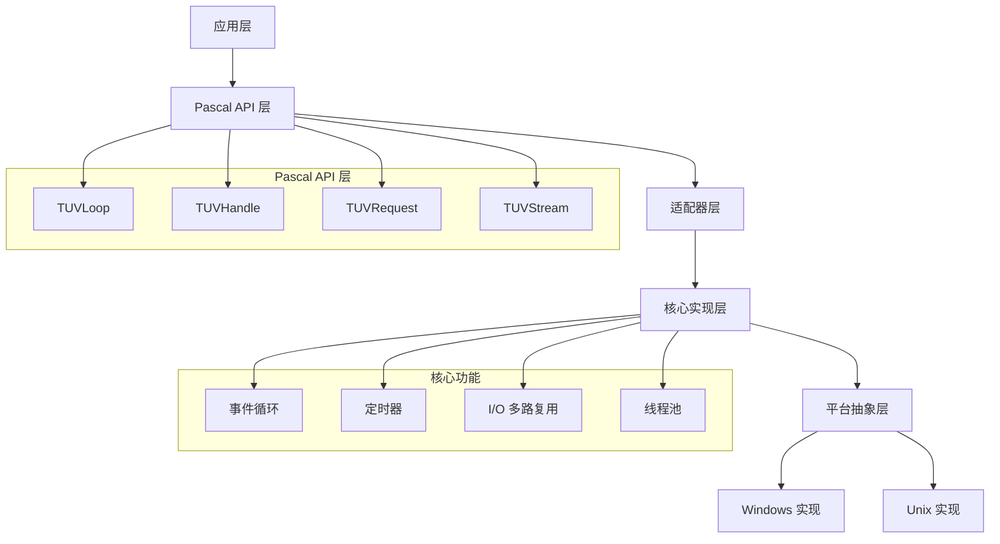

# FreePascal libuv 移植可行性分析与实施计划

## 移植可行性评估

### 优势分析

#### 1. 技术优势
- **清晰的 C API**: libuv 提供了简洁明了的 C 接口，便于 Pascal 绑定
- **模块化设计**: 核心功能相对独立，可以分阶段移植
- **丰富文档**: 有详细的 API 文档、设计文档和示例代码
- **成熟稳定**: 经过 Node.js 等大量生产环境验证
- **跨平台**: 已经解决了主要的跨平台兼容性问题

#### 2. Pascal 语言优势
- **系统编程能力**: FreePascal 具备底层系统编程能力
- **内存管理**: 支持手动内存管理和自动管理的混合模式
- **平台支持**: 支持 Windows、Linux、macOS 等主要平台
- **性能**: 编译后性能接近 C 语言
- **类型安全**: 强类型系统有助于减少运行时错误

### 挑战分析

#### 1. 技术挑战
- **回调机制**: C 的函数指针 vs Pascal 的方法指针/匿名方法
- **内存管理**: C 的手动管理 vs Pascal 的混合管理
- **平台相关代码**: 需要处理 Windows/Unix 的差异
- **线程安全**: 确保多线程环境下的安全性
- **性能优化**: 保持与原版相当的性能水平

#### 2. 工程挑战
- **测试覆盖**: 需要编写全面的测试用例
- **文档维护**: 需要维护 Pascal 版本的文档
- **社区支持**: 需要建立用户和开发者社区
- **持续维护**: 跟进 libuv 的更新和 bug 修复

## 架构设计

### 1. 分层架构



### 2. 核心类设计

```pascal
unit UV.Core;

interface

type
  // 基础类型
  TUVError = Integer;
  TUVHandle = THandle;
  
  // 前向声明
  TUVLoop = class;
  TUVHandle = class;
  TUVRequest = class;
  
  // 回调类型
  TUVCallback = procedure(Handle: TUVHandle; Status: TUVError) of object;
  TUVAllocCallback = procedure(Handle: TUVHandle; SuggestedSize: NativeUInt; var Buf: TBytes) of object;
  TUVReadCallback = procedure(Stream: TUVStream; NRead: NativeInt; const Data: TBytes) of object;
  
  // 事件循环
  TUVRunMode = (uvRunDefault, uvRunOnce, uvRunNoWait);
  
  TUVLoop = class
  private
    FData: Pointer;
    FActiveHandles: Cardinal;
    FStopFlag: Boolean;
    FHandles: TList<TUVHandle>;
    FTimers: TList<TUVTimer>;
  public
    constructor Create;
    destructor Destroy; override;
    
    function Run(Mode: TUVRunMode = uvRunDefault): Integer;
    procedure Stop;
    function IsAlive: Boolean;
    
    property Data: Pointer read FData write FData;
  end;
  
  // 句柄基类
  TUVHandle = class abstract
  private
    FLoop: TUVLoop;
    FData: Pointer;
    FCloseCallback: TUVCallback;
    FActive: Boolean;
    FClosing: Boolean;
  protected
    procedure DoClose; virtual; abstract;
  public
    constructor Create(ALoop: TUVLoop);
    destructor Destroy; override;
    
    procedure Close(Callback: TUVCallback = nil);
    procedure Ref;
    procedure Unref;
    
    property Loop: TUVLoop read FLoop;
    property Data: Pointer read FData write FData;
    property Active: Boolean read FActive;
  end;
  
  // 流基类
  TUVStream = class(TUVHandle)
  private
    FReadCallback: TUVReadCallback;
    FAllocCallback: TUVAllocCallback;
    FWriteQueueSize: NativeUInt;
  protected
    function DoRead(var Buffer: TBytes): Integer; virtual; abstract;
    function DoWrite(const Data: TBytes): Integer; virtual; abstract;
  public
    function ReadStart(AllocCB: TUVAllocCallback; ReadCB: TUVReadCallback): Integer;
    function ReadStop: Integer;
    function Write(const Data: TBytes; Callback: TUVCallback = nil): Integer;
    
    property WriteQueueSize: NativeUInt read FWriteQueueSize;
  end;
  
  // TCP 流
  TUVTCP = class(TUVStream)
  private
    FSocket: TSocket;
    FConnected: Boolean;
  protected
    function DoRead(var Buffer: TBytes): Integer; override;
    function DoWrite(const Data: TBytes): Integer; override;
    procedure DoClose; override;
  public
    constructor Create(ALoop: TUVLoop);
    
    function Bind(const Address: string; Port: Word): Integer;
    function Listen(Backlog: Integer; Callback: TUVCallback): Integer;
    function Accept(Client: TUVTCP): Integer;
    function Connect(const Address: string; Port: Word; Callback: TUVCallback): Integer;
    
    property Connected: Boolean read FConnected;
  end;
  
  // 定时器
  TUVTimer = class(TUVHandle)
  private
    FTimeout: UInt64;
    FRepeat: UInt64;
    FCallback: TUVCallback;
    FActive: Boolean;
  protected
    procedure DoClose; override;
  public
    constructor Create(ALoop: TUVLoop);
    
    function Start(Callback: TUVCallback; Timeout, Repeat: UInt64): Integer;
    function Stop: Integer;
    function Again: Integer;
    
    procedure SetRepeat(Repeat: UInt64);
    function GetRepeat: UInt64;
    
    property Timeout: UInt64 read FTimeout;
  end;

implementation

// 实现代码...

end.
```

## 实施计划

### 阶段 1: 基础框架 (4-6 周)

#### 目标
- 建立项目结构和构建系统
- 实现基础的事件循环框架
- 完成核心数据结构

#### 任务清单
1. **项目初始化**
   - 创建 Git 仓库和目录结构
   - 设置 FreePascal 构建脚本
   - 配置 CI/CD 流水线

2. **核心类实现**
   - `TUVLoop` 基础实现
   - `TUVHandle` 抽象基类
   - `TUVRequest` 基础实现
   - 错误处理机制

3. **平台抽象层**
   - 平台检测和条件编译
   - 基础的平台抽象接口
   - Windows/Unix 基础实现

4. **基础测试**
   - 单元测试框架搭建
   - 基础功能测试用例
   - 内存泄漏检测

#### 交付物
- 可编译的基础框架
- 基础测试套件
- 项目文档和构建说明

### 阶段 2: 定时器和基础 I/O (3-4 周)

#### 目标
- 实现定时器功能
- 完成基础的 I/O 多路复用
- 支持简单的网络操作

#### 任务清单
1. **定时器实现**
   - 最小堆数据结构
   - `TUVTimer` 完整实现
   - 高精度时间管理

2. **I/O 多路复用**
   - epoll (Linux) 实现
   - IOCP (Windows) 基础实现
   - select/poll 回退实现

3. **基础网络 I/O**
   - `TUVTCP` 基础实现
   - 连接建立和数据传输
   - 错误处理和资源清理

4. **测试和验证**
   - 定时器精度测试
   - 网络连接测试
   - 并发性能测试

#### 交付物
- 功能完整的定时器
- 基础的 TCP 网络支持
- 性能基准测试

### 阶段 3: 完整网络支持 (4-5 周)

#### 目标
- 完成 TCP/UDP 全功能支持
- 实现管道和 TTY 支持
- 优化网络性能

#### 任务清单
1. **TCP 完整实现**
   - 服务器监听和客户端连接
   - 异步读写操作
   - 连接池和背压控制

2. **UDP 支持**
   - `TUVUDP` 实现
   - 数据报发送和接收
   - 多播支持

3. **管道和 TTY**
   - 命名管道支持
   - 标准输入输出处理
   - 进程间通信

4. **性能优化**
   - 零拷贝优化
   - 批量 I/O 处理
   - 内存池优化

#### 交付物
- 完整的网络 I/O 支持
- 管道和 TTY 功能
- 性能优化报告

### 阶段 4: 文件系统和进程管理 (3-4 周)

#### 目标
- 实现异步文件系统操作
- 支持子进程管理
- 完成信号处理

#### 任务清单
1. **文件系统操作**
   - 异步文件读写
   - 目录操作
   - 文件监控

2. **进程管理**
   - 子进程创建和管理
   - 进程间通信
   - 进程退出处理

3. **信号处理**
   - Unix 信号处理
   - Windows 事件处理
   - 跨平台信号抽象

4. **线程池**
   - 工作线程管理
   - 任务队列调度
   - CPU 密集型任务处理

#### 交付物
- 完整的文件系统 API
- 进程管理功能
- 线程池实现

### 阶段 5: 高级功能和优化 (4-6 周)

#### 目标
- 实现高级功能特性
- 性能优化和调优
- 完善文档和示例

#### 任务清单
1. **高级功能**
   - DNS 解析
   - 线程同步原语
   - 共享内存支持

2. **性能优化**
   - 内存使用优化
   - CPU 使用优化
   - I/O 性能调优

3. **工具和调试**
   - 性能分析工具
   - 内存泄漏检测
   - 调试辅助功能

4. **文档和示例**
   - API 参考文档
   - 使用指南和教程
   - 示例程序集合

#### 交付物
- 功能完整的 libuv Pascal 版本
- 性能测试报告
- 完整的文档和示例

### 阶段 6: 测试和发布准备 (2-3 周)

#### 目标
- 全面测试和 bug 修复
- 性能基准测试
- 发布准备

#### 任务清单
1. **全面测试**
   - 功能测试覆盖
   - 压力测试和稳定性测试
   - 跨平台兼容性测试

2. **性能验证**
   - 与原版 libuv 性能对比
   - 内存使用分析
   - 并发性能测试

3. **发布准备**
   - 版本号和发布说明
   - 安装包制作
   - 社区发布准备

#### 交付物
- 稳定的 1.0 版本
- 性能基准报告
- 发布包和文档

## 技术风险和缓解策略

### 1. 性能风险
**风险**: Pascal 版本性能不如原版 C 实现
**缓解**: 
- 早期建立性能基准测试
- 关键路径使用汇编优化
- 借鉴 libuv 的优化策略

### 2. 兼容性风险
**风险**: 跨平台兼容性问题
**缓解**:
- 建立多平台 CI 测试
- 参考 libuv 的平台处理方式
- 逐步增加平台支持

### 3. 维护风险
**风险**: 长期维护和更新困难
**缓解**:
- 建立清晰的代码架构
- 完善的测试覆盖
- 社区参与和贡献

### 4. API 设计风险
**风险**: API 设计不符合 Pascal 习惯
**缓解**:
- 早期用户反馈收集
- 参考其他成功的 Pascal 库
- 迭代式 API 设计

## 资源需求

### 人力资源
- **核心开发者**: 2-3 人，具备系统编程和网络编程经验
- **测试工程师**: 1 人，负责测试用例编写和自动化测试
- **文档工程师**: 1 人，负责文档编写和维护

### 硬件资源
- **开发环境**: Windows、Linux、macOS 开发机器
- **测试环境**: 多平台测试服务器
- **CI/CD**: GitHub Actions 或类似服务

### 时间资源
- **总开发时间**: 20-28 周
- **测试和优化**: 4-6 周
- **文档和发布**: 2-3 周

## 成功标准

### 功能标准
- [ ] 完整实现 libuv 核心 API
- [ ] 支持 Windows、Linux、macOS 三大平台
- [ ] 通过所有功能测试用例
- [ ] 内存泄漏检测通过

### 性能标准
- [ ] 性能不低于原版 libuv 的 80%
- [ ] 内存使用不超过原版的 120%
- [ ] 并发连接数达到原版的 90%

### 质量标准
- [ ] 代码覆盖率达到 85% 以上
- [ ] 无严重安全漏洞
- [ ] 文档完整度达到 90%
- [ ] 社区反馈积极

## 总结

FreePascal libuv 移植项目具有良好的可行性，主要优势在于：

1. **技术可行**: libuv 的清晰架构和 FreePascal 的系统编程能力
2. **市场需求**: Pascal 社区对现代异步 I/O 库的需求
3. **差异化价值**: 为 Pascal 生态提供高性能网络编程能力

通过分阶段实施、风险控制和质量保证，可以成功交付一个高质量的 Pascal 版本 libuv 库。
