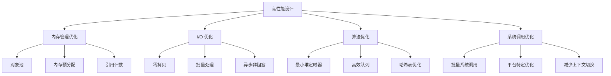

# libuv 性能分析和内存管理

## 性能设计原则

libuv 的高性能来源于多个层面的精心设计和优化：



## 内存管理策略

### 1. 对象池机制

libuv 使用对象池来减少内存分配和释放的开销：

```c
/* 请求对象池 */
static uv_req_t* req_pool = NULL;
static uv_mutex_t req_pool_mutex;

uv_req_t* uv__req_alloc(uv_req_type type) {
  uv_req_t* req;
  
  uv_mutex_lock(&req_pool_mutex);
  if (req_pool != NULL) {
    req = req_pool;
    req_pool = req->next;
    uv_mutex_unlock(&req_pool_mutex);
    
    memset(req, 0, sizeof(*req));
    req->type = type;
    return req;
  }
  uv_mutex_unlock(&req_pool_mutex);
  
  /* 池中没有可用对象，分配新的 */
  req = uv__malloc(sizeof(*req));
  if (req != NULL) {
    memset(req, 0, sizeof(*req));
    req->type = type;
  }
  
  return req;
}

void uv__req_free(uv_req_t* req) {
  uv_mutex_lock(&req_pool_mutex);
  req->next = req_pool;
  req_pool = req;
  uv_mutex_unlock(&req_pool_mutex);
}
```

### 2. 内存预分配

```c
/* 预分配缓冲区数组 */
#define UV_REQ_BUFSML_SIZE 4

struct uv_write_s {
  UV_REQ_FIELDS
  uv_write_cb cb;
  uv_stream_t* send_handle;
  uv_stream_t* handle;
  uv_buf_t* bufs;
  unsigned int nbufs;
  int error;
  uv_buf_t bufsml[UV_REQ_BUFSML_SIZE];  /* 小缓冲区预分配 */
  UV_WRITE_PRIVATE_FIELDS
};

/* 动态分配策略 */
int uv_write(uv_write_t* req, uv_stream_t* handle, const uv_buf_t bufs[],
             unsigned int nbufs, uv_write_cb cb) {
  
  /* 小数量缓冲区使用预分配空间 */
  if (nbufs <= ARRAY_SIZE(req->bufsml)) {
    req->bufs = req->bufsml;
  } else {
    /* 大数量缓冲区动态分配 */
    req->bufs = uv__malloc(nbufs * sizeof(bufs[0]));
    if (req->bufs == NULL)
      return UV_ENOMEM;
  }
  
  memcpy(req->bufs, bufs, nbufs * sizeof(bufs[0]));
  req->nbufs = nbufs;
  
  return uv__write_req_submit(handle, req, cb);
}
```

### 3. 引用计数管理

```c
/* 句柄引用计数 */
void uv_ref(uv_handle_t* handle) {
  uv__handle_ref(handle);
  uv__loop_ref(handle->loop);
}

void uv_unref(uv_handle_t* handle) {
  uv__handle_unref(handle);
  uv__loop_unref(handle->loop);
}

static void uv__handle_ref(uv_handle_t* handle) {
  if (uv__has_ref(handle)) return;
  uv__handle_platform_init(handle);
  handle->flags |= UV_HANDLE_REF;
}

static void uv__handle_unref(uv_handle_t* handle) {
  if (!uv__has_ref(handle)) return;
  handle->flags &= ~UV_HANDLE_REF;
  if (uv__is_closing(handle)) return;
  uv__handle_stop(handle);
}
```

## I/O 性能优化

### 1. 零拷贝技术

```c
/* sendfile 系统调用实现零拷贝 */
static ssize_t uv__fs_sendfile(uv_fs_t* req) {
  int in_fd = req->flags;
  int out_fd = req->file;
  off_t off = req->off;
  size_t len = req->bufsml[0].len;

#if defined(__linux__)
  return sendfile(out_fd, in_fd, &off, len);
#elif defined(__FreeBSD__) || defined(__APPLE__)
  off_t sbytes;
  int r = sendfile(in_fd, out_fd, off, len, NULL, &sbytes, 0);
  req->off = sbytes;
  return r;
#else
  /* 回退到 read/write 循环 */
  return uv__fs_copy_file_range(req);
#endif
}

/* 直接缓冲区操作 */
typedef void (*uv_alloc_cb)(uv_handle_t* handle, size_t suggested_size, uv_buf_t* buf);

/* 用户控制内存分配，避免额外拷贝 */
static void on_alloc(uv_handle_t* handle, size_t suggested_size, uv_buf_t* buf) {
  /* 直接使用用户缓冲区 */
  buf->base = user_buffer;
  buf->len = user_buffer_size;
}
```

### 2. 批量 I/O 处理

```c
/* 批量写入优化 */
static int uv__write_req_submit(uv_stream_t* stream, uv_write_t* req, uv_write_cb cb) {
  req->cb = cb;
  req->handle = stream;
  req->error = 0;
  
  uv__queue_insert_tail(&stream->write_queue, &req->queue);
  stream->write_queue_size += uv__count_bufs(req->bufs, req->nbufs);
  
  /* 如果写队列为空，立即尝试写入 */
  if (uv__queue_head(&stream->write_queue) == &req->queue) {
    uv__write(stream);
  }
  
  return 0;
}

/* 批量读取优化 */
static void uv__read(uv_stream_t* stream) {
  uv_buf_t buf;
  ssize_t nread;
  
  /* 预分配多个缓冲区 */
  for (int i = 0; i < 16; i++) {
    stream->alloc_cb((uv_handle_t*)stream, 65536, &buf);
    if (buf.len == 0) break;
    
    nread = read(uv__stream_fd(stream), buf.base, buf.len);
    if (nread > 0) {
      stream->read_cb(stream, nread, &buf);
    } else if (nread == 0) {
      stream->read_cb(stream, UV_EOF, &buf);
      break;
    } else if (errno != EAGAIN && errno != EWOULDBLOCK) {
      stream->read_cb(stream, UV__ERR(errno), &buf);
      break;
    } else {
      stream->read_cb(stream, 0, &buf);
      break;
    }
  }
}
```

### 3. 写入队列优化

```c
/* 写入队列管理 */
struct uv_stream_s {
  // ... 其他字段
  size_t write_queue_size;          /* 写队列总大小 */
  struct uv__queue write_queue;     /* 写请求队列 */
  struct uv__queue write_completed_queue; /* 完成队列 */
  uv_connect_t* connect_req;
  uv_shutdown_t* shutdown_req;
  uv__io_t io_watcher;
  size_t write_queue_size;
};

/* 背压控制 */
#define UV_STREAM_WRITE_QUEUE_MAX_SIZE (16 * 1024 * 1024)

static int uv__write_req_submit(uv_stream_t* stream, uv_write_t* req, uv_write_cb cb) {
  /* 检查写队列大小，实现背压控制 */
  if (stream->write_queue_size > UV_STREAM_WRITE_QUEUE_MAX_SIZE) {
    return UV_ENOBUFS;
  }
  
  // ... 提交写请求
}
```

## 算法优化

### 1. 定时器最小堆

```c
/* 最小堆实现 */
struct heap {
  struct heap_node* min;
  unsigned int nelts;
};

struct heap_node {
  struct heap_node* left;
  struct heap_node* right;
  struct heap_node* parent;
};

/* O(log n) 插入 */
void heap_insert(struct heap* heap, struct heap_node* newnode, heap_compare_fn less_than) {
  struct heap_node** parent;
  struct heap_node** child;
  unsigned int path;
  unsigned int n;
  unsigned int k;

  newnode->left = NULL;
  newnode->right = NULL;
  newnode->parent = NULL;

  /* Calculate the path from the root to the insertion point. */
  path = 0;
  for (k = 0, n = 1 + heap->nelts; n >= 2; k += 1, n /= 2)
    path = (path << 1) | (n & 1);

  /* Now traverse the heap using the path we calculated in the previous step. */
  parent = &heap->min;
  for (k -= 1; k > 0; k -= 1) {
    parent = path & (1 << k) ? &(*parent)->right : &(*parent)->left;
  }

  /* Insert the new node. */
  newnode->parent = *parent;
  *parent = newnode;
  heap->nelts += 1;

  /* Walk up the tree and check at each node if the heap property holds.
   * It's a min heap so parent < child must be true.
   */
  while (newnode->parent != NULL && less_than(newnode, newnode->parent))
    heap_sift_up(newnode);
}

/* O(log n) 删除最小元素 */
struct heap_node* heap_dequeue(struct heap* heap, heap_compare_fn less_than) {
  struct heap_node* min;
  struct heap_node* child;
  unsigned int path;
  unsigned int k;
  unsigned int n;

  if (heap->nelts == 0)
    return NULL;

  min = heap->min;
  heap->nelts -= 1;

  /* Replace the root node with the last node. */
  if (heap->nelts == 0) {
    heap->min = NULL;
    return min;
  }

  /* Calculate the path from the min (root) to the max (last) node. */
  path = 0;
  for (k = 0, n = heap->nelts; n >= 1; k += 1, n /= 2)
    path = (path << 1) | (n & 1);

  /* Now traverse the heap to find the last node. */
  child = heap->min;
  for (k -= 1; k > 0; k -= 1) {
    child = path & (1 << k) ? child->right : child->left;
  }

  /* Replace the to be deleted node with the last node. */
  heap_replace(heap, min, child);

  /* Walk down the subtree and check at each node if the heap property holds.
   * It's a min heap so parent < child must be true.  If not, swap and repeat.
   */
  heap_sift_down(heap, child, less_than);

  return min;
}
```

### 2. 高效队列实现

```c
/* 双向链表队列 */
struct uv__queue {
  struct uv__queue* next;
  struct uv__queue* prev;
};

/* 常数时间操作 */
#define uv__queue_init(q)                                                     \
  do {                                                                        \
    (q)->next = (q);                                                          \
    (q)->prev = (q);                                                          \
  }                                                                           \
  while (0)

#define uv__queue_insert_head(h, q)                                           \
  do {                                                                        \
    (q)->next = (h)->next;                                                    \
    (q)->prev = (h);                                                          \
    (q)->next->prev = (q);                                                    \
    (h)->next = (q);                                                          \
  }                                                                           \
  while (0)

#define uv__queue_insert_tail(h, q)                                           \
  do {                                                                        \
    (q)->next = (h);                                                          \
    (q)->prev = (h)->prev;                                                    \
    (q)->prev->next = (q);                                                    \
    (h)->prev = (q);                                                          \
  }                                                                           \
  while (0)

#define uv__queue_remove(q)                                                   \
  do {                                                                        \
    (q)->prev->next = (q)->next;                                              \
    (q)->next->prev = (q)->prev;                                              \
  }                                                                           \
  while (0)
```

### 3. 哈希表优化

```c
/* 文件描述符哈希表 */
#define UV__FD_HASH_SIZE 256

static uv__io_t* fd_hash[UV__FD_HASH_SIZE];

static unsigned int fd_hash_func(int fd) {
  /* 简单但有效的哈希函数 */
  return (unsigned int)fd % UV__FD_HASH_SIZE;
}

static uv__io_t* uv__io_find(uv_loop_t* loop, int fd) {
  unsigned int h = fd_hash_func(fd);
  uv__io_t* w;
  
  for (w = fd_hash[h]; w != NULL; w = w->next_hash) {
    if (w->fd == fd)
      return w;
  }
  
  return NULL;
}

static void uv__io_insert(uv_loop_t* loop, uv__io_t* w, int fd) {
  unsigned int h = fd_hash_func(fd);
  
  w->fd = fd;
  w->next_hash = fd_hash[h];
  fd_hash[h] = w;
}
```

## 系统调用优化

### 1. 批量系统调用

```c
/* epoll 批量事件处理 */
void uv__io_poll(uv_loop_t* loop, int timeout) {
  struct epoll_event events[1024];  /* 批量处理事件 */
  int nfds;
  int i;

  /* 一次系统调用获取多个事件 */
  nfds = epoll_wait(loop->backend_fd, events, ARRAY_SIZE(events), timeout);
  
  /* 批量处理所有就绪事件 */
  for (i = 0; i < nfds; i++) {
    /* 处理单个事件 */
    uv__io_feed(loop, events[i].data.fd, events[i].events);
  }
}

/* Windows IOCP 批量完成处理 */
void uv__poll(uv_loop_t* loop, int timeout) {
  OVERLAPPED_ENTRY overlappeds[128];
  ULONG count;
  BOOL success;

  /* 批量获取完成的 I/O 操作 */
  success = GetQueuedCompletionStatusEx(loop->iocp,
                                        overlappeds,
                                        ARRAY_SIZE(overlappeds),
                                        &count,
                                        timeout,
                                        FALSE);
  
  if (success) {
    /* 批量处理完成的操作 */
    for (ULONG i = 0; i < count; i++) {
      uv_req_t* req = uv_overlapped_to_req(overlappeds[i].lpOverlapped);
      uv_insert_pending_req(loop, req);
    }
  }
}
```

### 2. 系统调用缓存

```c
/* 时间缓存避免频繁 gettimeofday */
static uint64_t cached_time = 0;
static uint64_t time_update_counter = 0;

uint64_t uv__hrtime(uv_clocktype_t type) {
  static uint64_t fast_time_base = 0;
  static uint64_t fast_time_offset = 0;
  uint64_t time_counter;
  
  if (type == UV_CLOCK_FAST) {
    time_counter = __rdtsc();  /* CPU 时间戳计数器 */
    if (time_counter - time_update_counter > 1000000) {
      /* 每隔一段时间更新一次真实时间 */
      fast_time_base = uv__hrtime(UV_CLOCK_PRECISE);
      fast_time_offset = time_counter;
      time_update_counter = time_counter;
    }
    return fast_time_base + (time_counter - fast_time_offset) * time_scale;
  }
  
  /* 精确时间获取 */
  return uv__hrtime_precise();
}
```

## FreePascal 移植性能考虑

### 1. 内存管理适配

```pascal
type
  TUVObjectPool<T: class> = class
  private
    FPool: TStack<T>;
    FLock: TCriticalSection;
    FCreateFunc: TFunc<T>;
  public
    constructor Create(CreateFunc: TFunc<T>);
    destructor Destroy; override;
    function Acquire: T;
    procedure Release(Obj: T);
  end;

  TUVRequestPool = TUVObjectPool<TUVRequest>;
  TUVHandlePool = TUVObjectPool<TUVHandle>;

var
  GlobalRequestPool: TUVRequestPool;
  GlobalHandlePool: TUVHandlePool;
```

### 2. 高效数据结构

```pascal
type
  TUVQueue<T> = class
  private
    FHead: PQueueNode;
    FTail: PQueueNode;
  public
    procedure Enqueue(const Item: T);
    function Dequeue: T;
    function IsEmpty: Boolean;
  end;

  TUVMinHeap<T> = class
  private
    FItems: TArray<T>;
    FCount: Integer;
    FComparer: IComparer<T>;
  public
    procedure Insert(const Item: T);
    function ExtractMin: T;
    property Count: Integer read FCount;
  end;
```

### 3. 异步优化

```pascal
type
  TUVAsyncResult<T> = class
  private
    FValue: T;
    FException: Exception;
    FCompleted: Boolean;
    FEvent: TEvent;
  public
    procedure SetResult(const Value: T);
    procedure SetException(E: Exception);
    function GetResult: T;
    function Wait(Timeout: Cardinal = INFINITE): Boolean;
  end;

  TUVTask<T> = class
  public
    class function Run<T>(Func: TFunc<T>): TUVAsyncResult<T>;
    class function WhenAll<T>(const Tasks: array of TUVAsyncResult<T>): TUVAsyncResult<TArray<T>>;
  end;
```

## 性能测试和监控

### 1. 性能指标

```c
/* libuv 内置性能监控 */
typedef struct {
  uint64_t loop_count;
  uint64_t events;
  uint64_t events_waiting;
  uint64_t* providers;
} uv_metrics_t;

int uv_metrics_info(uv_loop_t* loop, uv_metrics_t* metrics) {
  uv__loop_internal_fields_t* lfields;
  
  lfields = uv__get_internal_fields(loop);
  uv_mutex_lock(&lfields->loop_metrics.lock);
  
  *metrics = lfields->loop_metrics.metrics;
  
  uv_mutex_unlock(&lfields->loop_metrics.lock);
  return 0;
}
```

### 2. FreePascal 性能监控

```pascal
type
  TUVMetrics = record
    LoopCount: UInt64;
    EventCount: UInt64;
    EventsWaiting: UInt64;
    IOTime: UInt64;
    IdleTime: UInt64;
  end;

  TUVPerformanceMonitor = class
  private
    FMetrics: TUVMetrics;
    FStartTime: UInt64;
  public
    procedure StartMeasurement;
    procedure EndMeasurement;
    function GetMetrics: TUVMetrics;
    procedure ResetMetrics;
  end;
```

## 总结

libuv 的高性能来源于：

1. **内存管理优化**: 对象池、预分配、引用计数
2. **I/O 优化**: 零拷贝、批量处理、异步非阻塞
3. **算法优化**: 最小堆、高效队列、哈希表
4. **系统调用优化**: 批量调用、缓存机制
5. **平台特定优化**: 充分利用各平台特性

这些优化策略为 FreePascal 移植提供了重要的性能指导。
