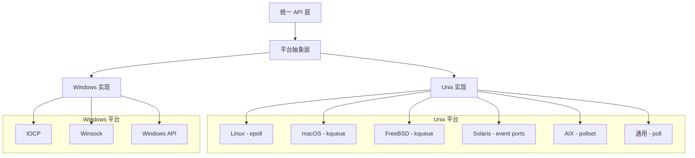

# libuv 平台抽象层分析

## 平台抽象概述

libuv 的核心优势之一是提供了统一的跨平台 API，同时在底层充分利用各平台的高性能特性。平台抽象层通过条件编译、函数指针和统一接口等技术实现。



## 条件编译策略

### 1. 平台检测

```c
#if defined(_WIN32)
  /* Windows 平台 */
# include "uv/win.h"
#else
  /* Unix-like 平台 */
# include "uv/unix.h"
#endif

/* 具体平台检测 */
#if defined(__linux__)
  /* Linux 特定代码 */
#elif defined(__APPLE__)
  /* macOS 特定代码 */
#elif defined(__FreeBSD__)
  /* FreeBSD 特定代码 */
#elif defined(__sun)
  /* Solaris 特定代码 */
#elif defined(_AIX)
  /* AIX 特定代码 */
#endif
```

### 2. 功能特性检测

```c
/* 检测 epoll 支持 */
#if defined(__linux__)
# define HAVE_EPOLL 1
#endif

/* 检测 kqueue 支持 */
#if defined(__APPLE__) || defined(__FreeBSD__) || defined(__OpenBSD__) || defined(__NetBSD__)
# define HAVE_KQUEUE 1
#endif

/* 检测 event ports 支持 */
#if defined(__sun) && defined(PORT_SOURCE_FD)
# define HAVE_EVENT_PORTS 1
#endif
```

## Windows vs Unix 核心差异

### 1. I/O 模型差异

**Windows - IOCP (I/O Completion Ports)**:
```c
/* Windows 异步 I/O 完成模型 */
typedef struct {
  OVERLAPPED overlapped;
  size_t queued_bytes;
  // ... 其他字段
} uv_req_t;

/* 提交异步操作 */
int uv__tcp_write(uv_loop_t* loop, uv_write_t* req, uv_tcp_t* handle,
                  const uv_buf_t bufs[], unsigned int nbufs, uv_stream_t* send_handle,
                  uv_write_cb cb) {
  // 设置 OVERLAPPED 结构
  memset(&req->u.io.overlapped, 0, sizeof(req->u.io.overlapped));
  
  // 提交异步写操作
  if (WSASend(handle->socket, (WSABUF*)bufs, nbufs, &bytes, 0,
              &req->u.io.overlapped, NULL) != 0) {
    if (WSAGetLastError() != WSA_IO_PENDING) {
      return uv_translate_sys_error(WSAGetLastError());
    }
  }
  
  return 0;
}

/* 处理完成的 I/O 操作 */
void uv__poll(uv_loop_t* loop, int timeout) {
  BOOL success;
  DWORD bytes;
  ULONG_PTR key;
  OVERLAPPED* overlapped;
  uv_req_t* req;

  success = GetQueuedCompletionStatus(loop->iocp,
                                      &bytes,
                                      &key,
                                      &overlapped,
                                      timeout);
  
  if (overlapped) {
    req = uv_overlapped_to_req(overlapped);
    uv_insert_pending_req(loop, req);
  }
}
```

**Unix - 事件驱动模型**:
```c
/* Unix 基于文件描述符的事件模型 */
void uv__io_poll(uv_loop_t* loop, int timeout) {
#if defined(HAVE_EPOLL)
  struct epoll_event events[1024];
  int nfds = epoll_wait(loop->backend_fd, events, 1024, timeout);
#elif defined(HAVE_KQUEUE)
  struct kevent events[1024];
  int nfds = kevent(loop->backend_fd, NULL, 0, events, 1024, 
                    timeout == -1 ? NULL : &spec);
#else
  struct pollfd* pfd;
  int nfds = poll(loop->watchers, loop->nwatchers, timeout);
#endif

  // 处理就绪的文件描述符
  for (i = 0; i < nfds; i++) {
    // 调用相应的回调函数
    w->cb(loop, w, events[i].events);
  }
}
```

### 2. 句柄管理差异

**Windows 句柄**:
```c
/* Windows 句柄类型 */
#define UV_HANDLE_FIELDS                                                      \
  void* data;                                                                 \
  uv_loop_t* loop;                                                            \
  uv_handle_type type;                                                        \
  uv_close_cb close_cb;                                                       \
  struct uv__queue handle_queue;                                              \
  union {                                                                     \
    int fd;                                                                   \
    void* reserved[4];                                                        \
  } u;                                                                        \
  UV_HANDLE_PRIVATE_FIELDS

/* Windows 私有字段 */
#define UV_HANDLE_PRIVATE_FIELDS                                              \
  uv_handle_t* endgame_next;                                                  \
  unsigned int flags;                                                         \
  DWORD error;                                                                \
  union {                                                                     \
    struct {                                                                  \
      uv_tcp_accept_t* accept_reqs;                                           \
      unsigned int processed_accepts;                                         \
      uv_tcp_accept_t* pending_accepts;                                       \
      LPFN_ACCEPTEX func_acceptex;                                            \
      LPFN_CONNECTEX func_connectex;                                          \
      LPFN_GETACCEPTEXSOCKADDRS func_getacceptexsockaddrs;                    \
      SOCKET socket;                                                          \
      int delayed_error;                                                      \
    } tcp;                                                                    \
    /* ... 其他句柄类型 */                                                      \
  };
```

**Unix 文件描述符**:
```c
/* Unix 文件描述符管理 */
#define UV_HANDLE_PRIVATE_FIELDS                                              \
  uv_handle_t* next_closing;                                                  \
  unsigned int flags;                                                         \
  int error;                                                                  \
  uv__io_t io_watcher;

/* I/O 观察者结构 */
struct uv__io_s {
  uv__io_cb cb;
  struct uv__queue pending_queue;
  struct uv__queue watcher_queue;
  unsigned int pevents; /* Pending event mask i.e. mask at next tick. */
  unsigned int events;  /* Current event mask. */
  int fd;
  UV_IO_PRIVATE_FIELDS
};
```

## 平台特定优化

### 1. Linux - epoll 优化

```c
/* epoll 的边缘触发优化 */
void uv__io_poll(uv_loop_t* loop, int timeout) {
  struct epoll_event events[1024];
  struct epoll_event* pe;
  int nfds;
  int i;

  /* 批量处理事件以提高性能 */
  nfds = epoll_wait(loop->backend_fd, events, ARRAY_SIZE(events), timeout);
  
  for (i = 0; i < nfds; i++) {
    pe = events + i;
    fd = pe->data.fd;
    
    /* 处理 EPOLLERR 和 EPOLLHUP 的特殊情况 */
    if (pe->events == POLLERR || pe->events == POLLHUP) {
      pe->events |= w->pevents & (POLLIN | POLLOUT | UV__POLLRDHUP | UV__POLLPRI);
    }
    
    if (pe->events != 0) {
      w->cb(loop, w, pe->events);
    }
  }
}

/* epoll 的文件描述符管理 */
static void uv__epoll_ctl_add(int epfd, int fd, struct epoll_event* ev) {
  if (epoll_ctl(epfd, EPOLL_CTL_ADD, fd, ev)) {
    if (errno != EEXIST)
      abort();
  }
}

static void uv__epoll_ctl_mod(int epfd, int fd, struct epoll_event* ev) {
  if (epoll_ctl(epfd, EPOLL_CTL_MOD, fd, ev)) {
    abort();
  }
}

static void uv__epoll_ctl_del(int epfd, int fd) {
  if (epoll_ctl(epfd, EPOLL_CTL_DEL, fd, NULL)) {
    abort();
  }
}
```

### 2. macOS - kqueue 优化

```c
/* kqueue 的多事件类型支持 */
void uv__fs_event_start(uv_fs_event_t* handle, const char* path) {
  struct kevent event;
  int fd;
  
  fd = open(path, O_RDONLY);
  if (fd == -1)
    return UV__ERR(errno);
    
  /* 监听文件系统事件 */
  EV_SET(&event, fd, EVFILT_VNODE, EV_ADD | EV_ONESHOT,
         NOTE_DELETE | NOTE_WRITE | NOTE_EXTEND | NOTE_ATTRIB | NOTE_RENAME,
         0, handle);
         
  if (kevent(handle->loop->backend_fd, &event, 1, NULL, 0, NULL) == -1) {
    return UV__ERR(errno);
  }
}

/* kqueue 的进程监控 */
int uv_spawn(uv_loop_t* loop, uv_process_t* process, const uv_process_options_t* options) {
  struct kevent event;
  pid_t pid;
  
  pid = fork();
  if (pid == 0) {
    /* 子进程 */
    execvp(options->file, options->args);
    _exit(127);
  } else if (pid > 0) {
    /* 父进程 - 监听子进程退出 */
    EV_SET(&event, pid, EVFILT_PROC, EV_ADD | EV_ONESHOT, NOTE_EXIT, 0, process);
    kevent(loop->backend_fd, &event, 1, NULL, 0, NULL);
    process->pid = pid;
  }
  
  return 0;
}
```

### 3. Windows - IOCP 优化

```c
/* IOCP 的重叠 I/O 优化 */
int uv_tcp_read_start(uv_tcp_t* handle, uv_alloc_cb alloc_cb, uv_read_cb read_cb) {
  uv_read_t* req;
  DWORD bytes, flags;
  int err;

  handle->flags |= UV_HANDLE_READING;
  handle->read_cb = read_cb;
  handle->alloc_cb = alloc_cb;

  /* 预投递多个读请求以提高性能 */
  for (int i = 0; i < 4; i++) {
    req = &handle->read_reqs[i];
    
    handle->alloc_cb((uv_handle_t*)handle, 65536, &req->u.io.buf);
    
    memset(&req->u.io.overlapped, 0, sizeof(req->u.io.overlapped));
    flags = 0;
    
    err = WSARecv(handle->socket,
                  (WSABUF*)&req->u.io.buf,
                  1,
                  &bytes,
                  &flags,
                  &req->u.io.overlapped,
                  NULL);
                  
    if (err != 0 && WSAGetLastError() != WSA_IO_PENDING) {
      return uv_translate_sys_error(WSAGetLastError());
    }
  }
  
  return 0;
}

/* IOCP 的批量完成处理 */
void uv__poll(uv_loop_t* loop, int timeout) {
  OVERLAPPED_ENTRY overlappeds[128];
  ULONG count;
  BOOL success;
  int i;

  /* 批量获取完成的 I/O 操作 */
  success = GetQueuedCompletionStatusEx(loop->iocp,
                                        overlappeds,
                                        ARRAY_SIZE(overlappeds),
                                        &count,
                                        timeout,
                                        FALSE);

  if (success) {
    for (i = 0; i < count; i++) {
      req = uv_overlapped_to_req(overlappeds[i].lpOverlapped);
      uv_insert_pending_req(loop, req);
    }
  }
}
```

## 统一接口实现

### 1. 错误码统一

```c
/* 平台错误码映射 */
int uv_translate_sys_error(int sys_errno) {
  switch (sys_errno) {
    case 0: return 0;
#if defined(EACCES)
    case EACCES: return UV_EACCES;
#endif
#if defined(EADDRINUSE)
    case EADDRINUSE: return UV_EADDRINUSE;
#endif
    /* Windows 错误码映射 */
#if defined(_WIN32)
    case WSAEACCES: return UV_EACCES;
    case WSAEADDRINUSE: return UV_EADDRINUSE;
#endif
    default: return UV_UNKNOWN;
  }
}

/* 错误信息获取 */
const char* uv_strerror(int err) {
  return uv__strerror_r(err);
}
```

### 2. 时间接口统一

```c
/* 高精度时间获取 */
uint64_t uv_hrtime(void) {
#if defined(_WIN32)
  LARGE_INTEGER counter;
  QueryPerformanceCounter(&counter);
  return counter.QuadPart;
#elif defined(__APPLE__)
  return mach_absolute_time();
#elif defined(__linux__)
  struct timespec ts;
  clock_gettime(CLOCK_MONOTONIC, &ts);
  return ts.tv_sec * 1000000000ULL + ts.tv_nsec;
#else
  struct timeval tv;
  gettimeofday(&tv, NULL);
  return tv.tv_sec * 1000000ULL + tv.tv_usec;
#endif
}
```

### 3. 线程接口统一

```c
/* 线程创建 */
int uv_thread_create(uv_thread_t* tid, void (*entry)(void *arg), void* arg) {
#if defined(_WIN32)
  *tid = CreateThread(NULL, 0, (LPTHREAD_START_ROUTINE)entry, arg, 0, NULL);
  return *tid ? 0 : UV_ENOMEM;
#else
  return pthread_create(tid, NULL, entry, arg) ? UV_ENOMEM : 0;
#endif
}

/* 互斥锁 */
int uv_mutex_init(uv_mutex_t* mutex) {
#if defined(_WIN32)
  InitializeCriticalSection(mutex);
  return 0;
#else
  return pthread_mutex_init(mutex, NULL) ? UV_ENOMEM : 0;
#endif
}
```

## FreePascal 移植策略

### 1. 平台检测

```pascal
{$IFDEF WINDOWS}
  {$DEFINE UV_PLATFORM_WINDOWS}
{$ENDIF}

{$IFDEF LINUX}
  {$DEFINE UV_PLATFORM_LINUX}
  {$DEFINE UV_HAVE_EPOLL}
{$ENDIF}

{$IFDEF DARWIN}
  {$DEFINE UV_PLATFORM_DARWIN}
  {$DEFINE UV_HAVE_KQUEUE}
{$ENDIF}

{$IFDEF FREEBSD}
  {$DEFINE UV_PLATFORM_FREEBSD}
  {$DEFINE UV_HAVE_KQUEUE}
{$ENDIF}
```

### 2. 平台抽象接口

```pascal
type
  TUVPlatform = class abstract
  public
    class function InitLoop(Loop: TUVLoop): Integer; virtual; abstract;
    class function Poll(Loop: TUVLoop; Timeout: Integer): Integer; virtual; abstract;
    class function AddWatcher(Loop: TUVLoop; Watcher: TUVIOWatcher): Integer; virtual; abstract;
    class function RemoveWatcher(Loop: TUVLoop; Watcher: TUVIOWatcher): Integer; virtual; abstract;
    class function GetTime: UInt64; virtual; abstract;
  end;

{$IFDEF UV_PLATFORM_WINDOWS}
  TUVWindowsPlatform = class(TUVPlatform)
  public
    class function InitLoop(Loop: TUVLoop): Integer; override;
    class function Poll(Loop: TUVLoop; Timeout: Integer): Integer; override;
    // ... 其他方法实现
  end;
{$ENDIF}

{$IFDEF UV_PLATFORM_LINUX}
  TUVLinuxPlatform = class(TUVPlatform)
  public
    class function InitLoop(Loop: TUVLoop): Integer; override;
    class function Poll(Loop: TUVLoop; Timeout: Integer): Integer; override;
    // ... 其他方法实现
  end;
{$ENDIF}
```

### 3. 统一错误处理

```pascal
type
  TUVError = (
    uvOK = 0,
    uvEACCES = -13,
    uvEADDRINUSE = -98,
    uvECONNREFUSED = -111,
    // ... 其他错误码
  );

function TranslateSysError(SysError: Integer): TUVError;
begin
{$IFDEF WINDOWS}
  case SysError of
    ERROR_ACCESS_DENIED: Result := uvEACCES;
    WSAEADDRINUSE: Result := uvEADDRINUSE;
    WSAECONNREFUSED: Result := uvECONNREFUSED;
    else Result := TUVError(-SysError);
  end;
{$ELSE}
  case SysError of
    ESysEACCES: Result := uvEACCES;
    ESysEADDRINUSE: Result := uvEADDRINUSE;
    ESysECONNREFUSED: Result := uvECONNREFUSED;
    else Result := TUVError(-SysError);
  end;
{$ENDIF}
end;
```

## 总结

libuv 的平台抽象层设计体现了以下优秀特性：

1. **清晰的分层**: API 层、抽象层、实现层职责明确
2. **充分利用平台特性**: 每个平台都使用最优的系统调用
3. **统一的接口**: 隐藏平台差异，提供一致的编程体验
4. **高效的实现**: 针对不同平台的特定优化
5. **良好的可扩展性**: 易于添加新平台支持

这些设计原则为 FreePascal 移植提供了重要的架构指导。
