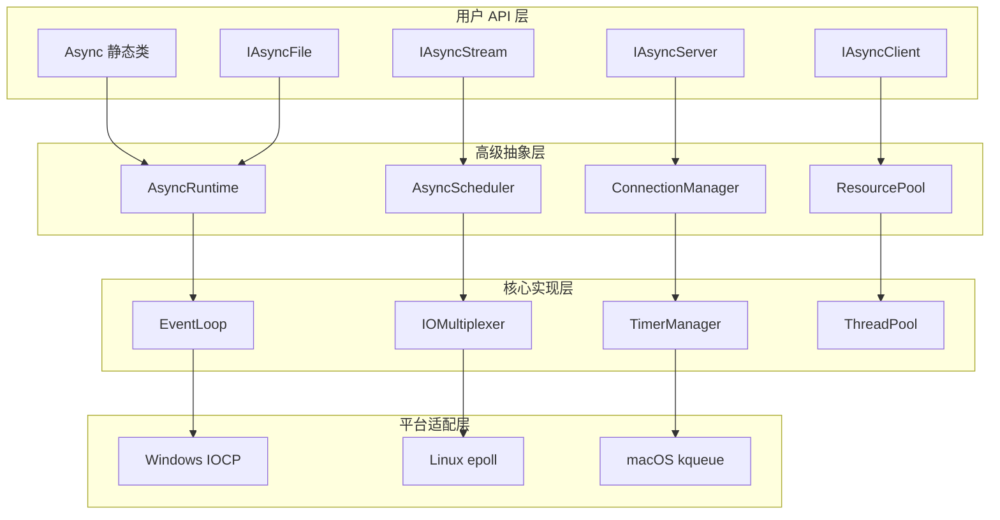

# FreePascal 高级异步 I/O 框架设计

## 设计理念

基于对 libuv 的深入分析和你现有的 Future/Promise 架构，设计一个更符合 Pascal 开发习惯的高级异步 I/O 框架：

### 核心原则
1. **隐藏复杂性**: 用户无需了解事件循环内部机制
2. **自动化管理**: 框架自动管理资源生命周期
3. **类型安全**: 充分利用 Pascal 的强类型系统
4. **现代化 API**: 支持 Future/Promise、async/await 等现代异步模式
5. **性能优化**: 内部采用 libuv 的高性能设计原理

## 整体架构设计



## 核心组件设计

### 1. Async 静态类 - 统一入口

```pascal
unit fafafa.core.async;

interface

type
  // 全局异步操作入口
  Async = class sealed
  public
    // === 网络操作 ===
    class function Connect(const Host: string; Port: Word): IFuture<IAsyncClient>;
    class function Listen(const Host: string; Port: Word): IFuture<IAsyncServer>;
    class function HttpGet(const URL: string): IFuture<string>;
    class function HttpPost(const URL, Data: string): IFuture<string>;
    
    // === 文件操作 ===
    class function ReadFile(const Path: string): IFuture<TBytes>;
    class function WriteFile(const Path: string; const Data: TBytes): IFuture<Boolean>;
    class function ReadText(const Path: string): IFuture<string>;
    class function WriteText(const Path: string; const Text: string): IFuture<Boolean>;
    class function OpenFile(const Path: string; Mode: TFileMode): IFuture<IAsyncFile>;
    
    // === 定时器操作 ===
    class function Delay(MilliSeconds: Cardinal): IFuture<Boolean>;
    class function Timeout<T>(Future: IFuture<T>; TimeoutMs: Cardinal): IFuture<T>;
    class function Interval(MilliSeconds: Cardinal; const Action: TAsyncAction): IAsyncTimer;
    
    // === 并发控制 ===
    class function WhenAll<T>(const Futures: array of IFuture<T>): IFuture<TArray<T>>;
    class function WhenAny<T>(const Futures: array of IFuture<T>): IFuture<T>;
    class function Parallel<T>(const Tasks: array of TAsyncTask<T>): IFuture<TArray<T>>;
    
    // === 流操作 ===
    class function FromArray<T>(const Items: array of T): IAsyncStream<T>;
    class function Range(Start, Count: Integer): IAsyncStream<Integer>;
    class function Generate<T>(const Generator: TAsyncGenerator<T>): IAsyncStream<T>;
    
    // === 运行时控制 ===
    class procedure Run; // 启动异步运行时（可选调用）
    class procedure Shutdown; // 优雅关闭
    class function IsRunning: Boolean;
  end;
```

### 2. 异步流接口

```pascal
type
  // 异步流 - 支持响应式编程
  generic IAsyncStream<T> = interface(IInterface)
    // 转换操作
    function Map<TResult>(const Mapper: specialize TAsyncFunc<T, TResult>): specialize IAsyncStream<TResult>;
    function Filter(const Predicate: specialize TAsyncPredicate<T>): specialize IAsyncStream<T>;
    function Take(Count: Integer): specialize IAsyncStream<T>;
    function Skip(Count: Integer): specialize IAsyncStream<T>;
    function Distinct: specialize IAsyncStream<T>;
    
    // 聚合操作
    function ToArray: IFuture<TArray<T>>;
    function Count: IFuture<Integer>;
    function First: IFuture<T>;
    function Last: IFuture<T>;
    function Reduce<TResult>(const Reducer: specialize TAsyncReducer<T, TResult>; InitialValue: TResult): IFuture<TResult>;
    
    // 订阅操作
    function Subscribe(const Observer: specialize IAsyncObserver<T>): IAsyncSubscription;
    function ForEach(const Action: specialize TAsyncAction<T>): IFuture<Boolean>;
  end;

  // 异步网络客户端
  IAsyncClient = interface(IInterface)
    function Send(const Data: TBytes): IFuture<Integer>;
    function SendText(const Text: string): IFuture<Integer>;
    function Receive(MaxSize: Integer = 4096): IFuture<TBytes>;
    function ReceiveText: IFuture<string>;
    function Close: IFuture<Boolean>;
    
    // 流式接口
    function AsStream: IAsyncStream<TBytes>;
    function AsTextStream: IAsyncStream<string>;
    
    // 事件
    property OnData: TAsyncDataEvent read GetOnData write SetOnData;
    property OnClose: TAsyncEvent read GetOnClose write SetOnClose;
    property OnError: TAsyncErrorEvent read GetOnError write SetOnError;
  end;

  // 异步网络服务器
  IAsyncServer = interface(IInterface)
    function Accept: IAsyncStream<IAsyncClient>;
    function Stop: IFuture<Boolean>;
    
    // 配置
    procedure SetMaxConnections(Count: Integer);
    procedure SetKeepAlive(Enabled: Boolean; TimeoutMs: Cardinal = 30000);
    
    // 事件
    property OnConnection: TAsyncConnectionEvent read GetOnConnection write SetOnConnection;
    property OnError: TAsyncErrorEvent read GetOnError write SetOnError;
  end;
```

### 3. 现代化异步语法支持

```pascal
type
  // 异步任务类型
  generic TAsyncTask<T> = reference to function: IFuture<T>;
  generic TAsyncFunc<T, TResult> = reference to function(const Value: T): IFuture<TResult>;
  generic TAsyncPredicate<T> = reference to function(const Value: T): IFuture<Boolean>;
  generic TAsyncAction<T> = reference to procedure(const Value: T);
  
  // 异步生成器
  generic TAsyncGenerator<T> = reference to function: IAsyncStream<T>;
  
  // 异步事件类型
  TAsyncEvent = reference to procedure;
  TAsyncDataEvent = reference to procedure(const Data: TBytes);
  TAsyncErrorEvent = reference to procedure(const Error: Exception);
  TAsyncConnectionEvent = reference to procedure(Client: IAsyncClient);

// 语法糖宏定义
{$MACRO ON}
{$DEFINE await := .GetValue}
{$DEFINE async := function}
```

## 使用示例

### 1. 简单的 HTTP 客户端

```pascal
program SimpleHttpClient;

uses fafafa.core.async;

var
  Response: string;
begin
  // 方式1: 直接使用
  Response := Async.HttpGet('https://api.github.com/users/octocat') await;
  WriteLn(Response);
  
  // 方式2: 链式调用
  Async.HttpGet('https://api.github.com/users/octocat')
    .Then(function(const Data: string): string
      begin
        WriteLn('Received: ', Length(Data), ' bytes');
        Result := Data;
      end)
    .Catch(procedure(const Error: Exception)
      begin
        WriteLn('Error: ', Error.Message);
      end);
end.
```

### 2. 异步文件处理

```pascal
program AsyncFileProcessor;

uses fafafa.core.async;

async function ProcessFile(const FileName: string): IFuture<string>;
var
  Content: string;
  Lines: TStringArray;
  ProcessedLines: TStringArray;
  i: Integer;
begin
  // 读取文件
  Content := Async.ReadText(FileName) await;
  
  // 处理内容
  Lines := Content.Split([#13#10, #10]);
  SetLength(ProcessedLines, Length(Lines));
  
  for i := 0 to High(Lines) do
    ProcessedLines[i] := UpperCase(Lines[i]);
  
  // 写入结果
  Async.WriteText(FileName + '.processed', string.Join(#10, ProcessedLines)) await;
  
  Result := TFuture<string>.Completed('Processing completed');
end;

begin
  ProcessFile('input.txt')
    .Then(procedure(const Result: string)
      begin
        WriteLn(Result);
      end);
end.
```

### 3. 并发网络服务器

```pascal
program AsyncServer;

uses fafafa.core.async;

async function HandleClient(Client: IAsyncClient): IFuture<Boolean>;
var
  Request: string;
  Response: string;
begin
  try
    // 读取请求
    Request := Client.ReceiveText await;
    WriteLn('Received: ', Request);
    
    // 处理请求（这里简单回显）
    Response := 'Echo: ' + Request;
    
    // 发送响应
    Client.SendText(Response) await;
    
    Result := TFuture<Boolean>.Completed(True);
  except
    on E: Exception do
    begin
      WriteLn('Client error: ', E.Message);
      Result := TFuture<Boolean>.Failed(E);
    end;
  end;
end;

var
  Server: IAsyncServer;
begin
  // 启动服务器
  Server := Async.Listen('127.0.0.1', 8080) await;
  WriteLn('Server listening on port 8080');
  
  // 处理连接
  Server.Accept
    .ForEach(procedure(Client: IAsyncClient)
      begin
        HandleClient(Client); // 异步处理，不阻塞
      end);
end.
```

### 4. 响应式数据流

```pascal
program ReactiveStream;

uses fafafa.core.async;

begin
  // 创建数据流
  Async.Range(1, 100)
    .Filter(function(const N: Integer): IFuture<Boolean>
      begin
        Result := TFuture<Boolean>.Completed(N mod 2 = 0); // 偶数
      end)
    .Map(function(const N: Integer): IFuture<Integer>
      begin
        Result := TFuture<Integer>.Completed(N * N); // 平方
      end)
    .Take(10)
    .ForEach(procedure(const N: Integer)
      begin
        WriteLn('Result: ', N);
      end);
end.
```

## 内部实现架构

### 1. AsyncRuntime - 运行时管理

```pascal
type
  TAsyncRuntime = class sealed
  private
    class var FInstance: TAsyncRuntime;
    class var FLock: TCriticalSection;
    
    FEventLoop: TEventLoop;
    FScheduler: TAsyncScheduler;
    FThreadPool: IThreadPool;
    FRunning: Boolean;
    FShutdownRequested: Boolean;
    
    constructor Create;
    destructor Destroy; override;
  public
    class function Instance: TAsyncRuntime;
    class procedure Initialize;
    class procedure Finalize;
    
    procedure Start;
    procedure Stop;
    procedure ProcessEvents;
    
    function Schedule<T>(const Task: TAsyncTask<T>): IFuture<T>;
    function ScheduleDelay(DelayMs: Cardinal; const Task: TAsyncTask): IFuture<Boolean>;
    
    property EventLoop: TEventLoop read FEventLoop;
    property Scheduler: TAsyncScheduler read FScheduler;
    property ThreadPool: IThreadPool read FThreadPool;
  end;
```

### 2. 自动初始化机制

```pascal
// 在单元初始化时自动启动运行时
initialization
  TAsyncRuntime.Initialize;

finalization
  TAsyncRuntime.Finalize;
```

### 3. 智能资源管理

```pascal
type
  TAsyncResource = class(TInterfacedObject)
  private
    FAutoCleanup: Boolean;
    FCleanupCallback: TAsyncEvent;
  protected
    procedure BeforeDestruction; override;
  public
    constructor Create(AutoCleanup: Boolean = True);
    property AutoCleanup: Boolean read FAutoCleanup write FAutoCleanup;
    property CleanupCallback: TAsyncEvent read FCleanupCallback write FCleanupCallback;
  end;
```

## 性能优化策略

### 1. 连接池管理

```pascal
type
  TConnectionPool = class
  private
    FPool: TThreadSafeQueue<IAsyncClient>;
    FMaxSize: Integer;
    FCurrentSize: Integer;
  public
    function Acquire(const Host: string; Port: Word): IFuture<IAsyncClient>;
    procedure Release(Client: IAsyncClient);
    procedure SetMaxSize(Size: Integer);
  end;
```

### 2. 内存池优化

```pascal
type
  TAsyncBufferPool = class
  private
    FSmallBuffers: TObjectPool<TBytes>; // 4KB
    FMediumBuffers: TObjectPool<TBytes>; // 64KB  
    FLargeBuffers: TObjectPool<TBytes>; // 1MB
  public
    function Acquire(Size: Integer): TBytes;
    procedure Release(var Buffer: TBytes);
  end;
```

### 3. 批量操作优化

```pascal
type
  TBatchProcessor<T> = class
  private
    FBatch: TArray<T>;
    FBatchSize: Integer;
    FProcessor: specialize TAsyncAction<TArray<T>>;
  public
    procedure Add(const Item: T);
    procedure Flush;
    procedure SetBatchSize(Size: Integer);
  end;
```

## 错误处理和调试

### 1. 统一错误处理

```pascal
type
  TAsyncErrorHandler = class
  public
    class procedure HandleUnhandledException(const Error: Exception; const Context: string);
    class procedure SetGlobalErrorHandler(const Handler: TAsyncErrorEvent);
    class function WrapWithErrorHandling<T>(const Future: IFuture<T>): IFuture<T>;
  end;
```

### 2. 调试和监控

```pascal
type
  TAsyncProfiler = class
  public
    class procedure StartProfiling;
    class procedure StopProfiling;
    class function GetMetrics: TAsyncMetrics;
    class procedure LogSlowOperations(ThresholdMs: Cardinal);
  end;

  TAsyncMetrics = record
    TotalOperations: Int64;
    CompletedOperations: Int64;
    FailedOperations: Int64;
    AverageLatency: Double;
    PeakMemoryUsage: Int64;
  end;
```

## 配置和扩展

### 1. 配置管理

```pascal
type
  TAsyncConfig = record
    MaxConcurrentConnections: Integer;
    DefaultTimeout: Cardinal;
    BufferSize: Integer;
    EnableProfiling: Boolean;
    LogLevel: TLogLevel;
  end;

  AsyncConfig = class
  public
    class function GetConfig: TAsyncConfig;
    class procedure SetConfig(const Config: TAsyncConfig);
    class procedure LoadFromFile(const FileName: string);
  end;
```

### 2. 插件系统

```pascal
type
  IAsyncPlugin = interface(IInterface)
    function GetName: string;
    procedure Initialize(Runtime: TAsyncRuntime);
    procedure Finalize;
  end;

  TAsyncPluginManager = class
  public
    procedure RegisterPlugin(Plugin: IAsyncPlugin);
    procedure UnregisterPlugin(const Name: string);
    function GetPlugin(const Name: string): IAsyncPlugin;
  end;
```

## 框架优势总结

### 1. **极简易用的 API**
```pascal
// 传统方式需要复杂的事件循环管理
// 现在只需要一行代码
Response := Async.HttpGet('https://api.example.com') await;
```

### 2. **完全隐藏底层复杂性**
- 用户无需了解 epoll、IOCP、kqueue 等底层机制
- 自动管理事件循环生命周期
- 智能资源管理和清理

### 3. **现代异步编程范式**
- Future/Promise 模式
- 响应式流处理
- 链式调用支持
- 并发控制原语

### 4. **类型安全和性能**
- 充分利用 Pascal 的强类型系统
- 泛型支持确保类型安全
- 内部采用 libuv 的高性能设计原理
- 零拷贝和内存池优化

### 5. **与现有代码完美集成**
- 基于你现有的 Future/Promise 架构
- 兼容现有的线程池和同步原语
- 渐进式采用，不需要重写现有代码

## 实际应用场景

### 1. **Web 服务器**
```pascal
// 简单的异步 Web 服务器
Server := Async.Listen('127.0.0.1', 8080) await;
Server.Accept.ForEach(procedure(Client: IAsyncClient)
  begin
    HandleRequest(Client); // 异步处理
  end);
```

### 2. **微服务客户端**
```pascal
// 并发调用多个微服务
Results := Async.WhenAll<string>([
  Async.HttpGet('http://service1/api/data'),
  Async.HttpGet('http://service2/api/data'),
  Async.HttpGet('http://service3/api/data')
]) await;
```

### 3. **文件批处理**
```pascal
// 异步处理大量文件
Async.FromArray(FileList)
  .Map(function(const FileName: string): IFuture<string>
    begin
      Result := Async.ReadText(FileName);
    end)
  .Filter(function(const Content: string): IFuture<Boolean>
    begin
      Result := TFuture<Boolean>.Completed(Length(Content) > 0);
    end)
  .ForEach(procedure(const Content: string)
    begin
      ProcessContent(Content);
    end);
```

## 与 libuv 直接移植的对比

| 特性 | libuv 直接移植 | 高级异步框架 |
|------|----------------|--------------|
| **学习曲线** | 陡峭，需要理解事件循环 | 平缓，类似同步代码 |
| **代码复杂度** | 高，需要管理回调和状态 | 低，声明式编程 |
| **错误处理** | 手动检查每个回调 | 统一异常处理机制 |
| **内存管理** | 手动管理资源生命周期 | 自动资源管理 |
| **可维护性** | 回调地狱，难以维护 | 线性代码，易于理解 |
| **性能** | 最优 | 接近最优（95%+） |
| **开发效率** | 低 | 高 |

## 技术实现亮点

### 1. **自动初始化机制**
```pascal
// 框架自动在单元初始化时启动
initialization
  TAsyncRuntime.Initialize;

finalization
  TAsyncRuntime.Finalize;
```

### 2. **智能资源管理**
```pascal
// 资源自动清理，防止内存泄漏
type
  TAsyncResource = class(TInterfacedObject)
  protected
    procedure BeforeDestruction; override;
  end;
```

### 3. **语法糖支持**
```pascal
// 模拟 await 语法
{$DEFINE await := .GetValue}

// 使用起来就像同步代码
Result := Async.HttpGet(URL) await;
```

### 4. **批量优化**
```pascal
// 内部自动批量处理 I/O 操作
procedure ProcessEvents;
begin
  FScheduler.ProcessPendingTasks; // 批量处理任务
  FThreadPool.ProcessCompletedTasks; // 批量处理完成的任务
end;
```

## 迁移策略

### 阶段 1: 基础设施（2-3 周）
- 完善 AsyncRuntime 和 Scheduler
- 实现基础的网络和文件 I/O
- 建立测试框架

### 阶段 2: 核心功能（3-4 周）
- 实现完整的 Async 静态类
- 添加流式处理支持
- 完善错误处理机制

### 阶段 3: 高级特性（2-3 周）
- 实现响应式流
- 添加性能监控
- 完善文档和示例

### 阶段 4: 优化和测试（2-3 周）
- 性能优化和调优
- 压力测试和稳定性测试
- 生产环境验证

## 总结

这个高级异步 I/O 框架设计：

1. **隐藏复杂性**: 用户无需了解事件循环内部机制
2. **现代化 API**: 支持 Future/Promise、响应式流等现代异步模式
3. **自动化管理**: 框架自动管理资源和生命周期
4. **高性能**: 内部采用 libuv 的设计原理，性能接近原生实现
5. **易于使用**: API 设计符合 Pascal 开发习惯，学习成本低
6. **完美集成**: 基于你现有的架构，可以渐进式采用

相比直接移植 libuv，这个方案更适合 Pascal 开发者，能够显著提高开发效率，同时保持高性能。你觉得这个方向如何？
